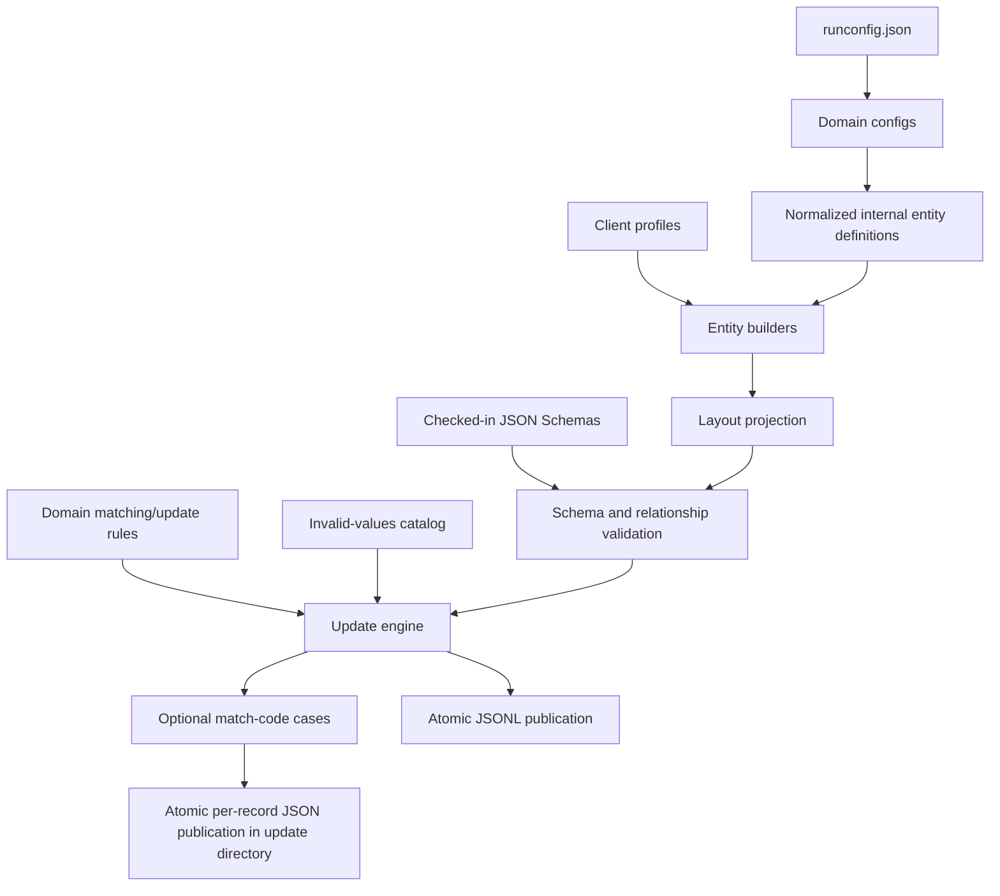

# Complete Project Documentation

## 1. Purpose and scope

This project generates realistic healthcare test data as newline-delimited JSON (JSONL). It supports:

- Provider CDF and NPPES data.
- Member 834 and Member Roster (MR) data.
- Professional 837P Claims and paired Claims History (CH).
- Institutional 837I Claims and paired Claims History (CH).
- Professional and Institutional 835 Payments derived from Claims.
- Creation fixtures and related update, missing, empty, invalid, duplicate, weight-boundary, and matching fixtures.

The generator is intended for development, QA, integration, matching, survivorship, and negative-validation testing. It creates synthetic data; it is not a production matching engine, adjudication engine, or source of real patient/provider information.

This document describes the current implementation in this repository. The authoritative runtime contracts are the checked-in configuration, layouts, schemas, and rule catalogs linked throughout this document.

## 2. Quick start

### Prerequisites

- Python 3.12 or newer.
- `uv` installed and available on `PATH`.

Install runtime and development dependencies:

```sh
cd /Users/gpandey/test-data-generator
uv sync --extra dev
```

Generate the complete checked-in data set:

```sh
uv run generate-data
```

Run all project checks:

```sh
make verify
```

The default run writes creation files to `output/new-test-data/` and update files to `output/update-test-data/`.

## 3. Project map

```text
test-data-generator/
├── runconfig.json                         Execution scope: domains and phases
├── config/
│   ├── provider.config.json               Provider CDF/NPPES selection and updates
│   ├── member.config.json                 Member 834/MR selection and updates
│   ├── claims.config.json                 837P/837I selection and updates
│   ├── payments.config.json               835P/835I scenarios and updates
├── schema/
│   ├── json/                              Runtime JSON Schemas
│   └── tools/                             Source-document audit utilities
├── src/test_data_generator/
│   ├── cli.py                             CLI orchestration and atomic publication
│   ├── configuration/
│   │   ├── config.py                      Config composition and validation
│   │   ├── client_profiles.json           Client headers/default values
│   │   ├── invalid-values.json            Shared invalid fixture values
│   │   ├── update-rule-catalog.json       Domain rule manifest
│   │   └── rules/                          Member/Provider/Claims/Payments rules
│   ├── core/                               Generic generation and validation engine
│   ├── entities/                           Domain record builders
│   ├── layouts/                            Emitted JSON field and nesting contracts
│   ├── samples/sample_shapes.json          Type-only sample shape defaults
│   └── update/                             Mutation, matching, and synchronization
└── tests/update/                           Regression and scenario tests
```

Important design rule: JSON Schemas define what is valid and available; layouts define what is emitted. A field may exist in a schema but not appear in output if the selected layout does not include it.

## 4. Architecture

### 4.1 Configuration layers

The project separates four concerns:

1. `runconfig.json` contains the global execution settings and selects domains and phases.
2. One domain file contains that domain's generation and scenario settings.
3. Domain files choose counts, Claim lifecycle behavior, Payment scenarios, and direct operation plans.
4. Rule, layout, schema, invalid-value, and client-profile files define business behavior and output validity.



### 4.2 End-to-end execution flow

`uv run generate-data` performs this flow:

1. Loads `runconfig.json`.
2. Validates its global settings, entity-config references, domain selection, and requested phases.
3. Loads exactly one Provider, Member, Claims, and Payments domain file.
4. Inherits direct Claims/Payments domain operations into their Professional and Institutional stream settings. The older `defaults` block remains a compatibility alias.
5. Normalizes each direct domain `operations` or `modifications` plan into the common internal update request.
6. Expands the public configuration into internal stream definitions. Schema paths, modules, and filenames are internal safe defaults and cannot be redirected to arbitrary code by configuration.
7. Creates a temporary, same-filesystem staging area and copies the previous requested output directories into it.
8. Generates creation streams in dependency order.
9. Optionally derives per-record, per-match-code cases from those creation records.
10. Generates updates from creation/base records when updates are enabled.
11. Propagates Claim changes to corresponding Claims History and enabled Payment streams.
12. Removes stale output only for known disabled streams.
13. Atomically swaps the completed staged directories into place. On failure, the previous complete output is restored.

### 4.3 Creation dependency order

The effective order is:

```text
Provider CDF/NPPES
        ↓
Member 834
        ↓
Member Roster (copied from 834)
        ↓
837P Claim ──→ Professional CH
        ↓
Professional 835 Payment

837I Claim ──→ Institutional CH
        ↓
Institutional 835 Payment
```

Claims can use generated Member and Provider records when those streams are enabled. If they are not enabled, Claims still generate self-contained synthetic relationship values. Same-run Payments derive from the newly generated CH records and do not require a hard-coded source path.

### 4.4 Validation layers

The project validates data at several points:

- Execution config against `execution_config.schema.json`.
- Composed generator config against `run_config.schema.json`.
- Counts, paths, scenario totals, Claim frequencies, and dependencies in the config loader.
- Every normal generated record against its entity JSON Schema.
- Payment-to-Claim identity, line count, matching fields, and scenario relationships.
- Matching fixtures against the requested `MATCH` or `NO_MATCH` result.
- Weight fixtures against below/equal/above threshold conditions.
- Update synchronization before publication.

`INVALID`, `MISSING`, and `EMPTY` fixtures may intentionally violate an entity schema. The generator allows the requested invalid update to be written so downstream validation behavior can be tested; creation records remain schema-valid.

## 5. Data sources and contracts

### 5.1 JSON Schemas

The checked-in schemas are loaded directly at runtime. They define allowed
fields, required fields, types, patterns, lengths, and entity-specific
constraints:

- [`schema/json/provider/provider.schema.json`](schema/json/provider/provider.schema.json)
- [`schema/json/provider/provider_nppes_individual.schema.json`](schema/json/provider/provider_nppes_individual.schema.json)
- [`schema/json/provider/provider_nppes_organizational.schema.json`](schema/json/provider/provider_nppes_organizational.schema.json)
- [`schema/json/member/member.schema.json`](schema/json/member/member.schema.json)
- [`schema/json/claim/claim.schema.json`](schema/json/claim/claim.schema.json)
- [`schema/json/payment/payment.schema.json`](schema/json/payment/payment.schema.json)

### 5.2 Layouts

Layouts are the exact emitted-field contracts:

- Provider: `provider.json`
- NPPES: separate Individual and Organizational layouts
- Member: `member.json`
- Claims: separate 837P and 837I profiles, standardized during Claim-pair materialization
- Payments: separate Professional and Institutional profiles using the shared 835 shape

Inspect a layout's field names:

```sh
jq -r '.headers[].name, .root[].name, (.groups[] | .[].name)' \
  src/test_data_generator/layouts/member.json
```

If a configured update field exists in the broad schema/rule catalog but not in the generated layout, the update fails early with a clear “not present in generated record” message.

### 5.3 Client profiles

[`client_profiles.json`](src/test_data_generator/configuration/client_profiles.json) supplies client-owned envelope values such as payer, platform, product, dataset, source format, and publisher. The current selectable client is `chc`.

To add a client, add complete `headers` and `values` entries for Provider, Member, Professional Claim, and Institutional Claim profiles, then set `client` in the global config. No entity generator should be forked merely to change client headers.

### 5.4 Sample shapes

[`sample_shapes.json`](src/test_data_generator/samples/sample_shapes.json) stores type-only shape information. It fills remaining sample fields with type-compatible defaults. It is not a source of real values and external sample files are not required at runtime.

### 5.5 Matching and update rules

[`update-rule-catalog.json`](src/test_data_generator/configuration/update-rule-catalog.json) is a manifest for four domain files:

- [`rules/member.json`](src/test_data_generator/configuration/rules/member.json)
- [`rules/provider.json`](src/test_data_generator/configuration/rules/provider.json)
- [`rules/claims.json`](src/test_data_generator/configuration/rules/claims.json)
- [`rules/payments.json`](src/test_data_generator/configuration/rules/payments.json)

Claims History reuses the corresponding Claim matching rules; it does not define
a separate History match code. It can nevertheless be generated and updated as
a standalone CH stream, or linked one-to-one to an 837 Claim stream.

### 5.6 Invalid values

[`invalid-values.json`](src/test_data_generator/configuration/invalid-values.json) is the only shared invalid-value source. Resolution first tries the exact field name, then semantic/type keys such as `NPI`, `SSN`, `DATE`, `AMOUNT`, `CODE`, `STRING`, `NUMBER`, `INTEGER`, `BOOLEAN`, and `DEFAULT`.

Normal creation and valid updates never use this file.

## 6. Configuration reference

### 6.1 `runconfig.json`

```json
{
  "client": "chc",
  "output_directory": "./output",
  "entities": ["provider", "member", "claims", "payments"],
  "operations": ["creation", "updates"],
  "generation": {
    "output_order": {"headers": "last"},
    "creation": {"enabled": true, "directory": "new-test-data"},
    "updates": {
      "enabled": true,
      "directory": "update-test-data",
      "rule_catalog": "src/test_data_generator/configuration/update-rule-catalog.json",
      "invalid_values_catalog": "src/test_data_generator/configuration/invalid-values.json"
    }
  },
  "entity_configs": {
    "provider": "config/provider.config.json",
    "member": "config/member.config.json",
    "claims": "config/claims.config.json",
    "payments": "config/payments.config.json"
  }
}
```

| Property | Required | Values | Meaning |
| --- | --- | --- | --- |
| `client` | Yes | Client profile name | Selects headers and client defaults. |
| `output_directory` | Optional | Relative or absolute path | Root directory for generated files. |
| `entities` | Optional | `provider`, `member`, `claims`, `payments` | Domain groups to retain. Omission uses every configured domain. |
| `operations` | Optional | `creation`, `updates` | Allowed phases. Default is both. |
| `generation` | Yes | Object | Output ordering, phase enablement, update rule catalog, and output directories. |
| `entity_configs` | Yes | Four paths | One scenario configuration file per domain. |

The CLI `--mode` cannot request a phase excluded by `runconfig.json`. With `--mode all`, a one-phase runconfig resolves to that one phase.

`runconfig.json` is the only global generator configuration. There is no separate `generator.config.json`, no common operation/profile configuration, and no global match-fixture section.

### 6.2 Global execution settings

The global properties are the top-level properties in `runconfig.json`; their paths are resolved relative to that file. `seed` is optional: omit it for varied Faker data across runs, or set it to reproduce a run.

| Property | Default/constraint | Meaning |
| --- | --- | --- |
| `client` | Required, currently `chc` | Selects client headers and values. |
| `seed` | Fresh 63-bit entropy when omitted | Makes values deterministic when explicitly set. |
| `output_directory` | `./output` | Root output path. |
| `generation.output_order.headers` | `source`; also `first` or `last` | Serialized header position. JSON meaning is unchanged. |
| `generation.creation.enabled` | `true` | Enables creation phase. |
| `generation.creation.directory` | `new-test-data` | Creation subdirectory. Must remain inside output root. |
| `generation.updates.enabled` | `false` unless set | Enables updates and per-match-code cases. |
| `generation.updates.directory` | `update-test-data` | Update subdirectory. Must remain inside output root. |
| `generation.updates.rule_catalog` | Packaged catalog if omitted | Domain update/matching rules. |
| `generation.updates.invalid_values_catalog` | Packaged catalog if omitted | Shared invalid values. |
| `entity_configs` | All four references required | Paths to one object per domain. |

### 6.3 Domain counts

Creation counts are integers from `0` through `1,000,000`.

- `count: 0` disables/skips that stream without error.
- `count` may be omitted for a stream that defines only `match_codes`. The
  generator creates an in-memory existing record for the fixture pair but does
  not publish that stream's normal creation JSONL file.
- Counts under `match_codes.*.generate` are exact fixture totals. They are not
  multiplied by the stream's creation `count`.
- A successful run removes stale known output for a disabled stream.
- Unrelated files in the output directory are not deleted.
- Member Roster count cannot exceed Member count.
- Provider CDF total is `nppes.count + cdf.additional_count` in linked mode.
- Linked Claims History count follows the corresponding effective Claim count.
  A standalone History stream instead uses its own `history.count`.
- Payment count is the final number of payment records after scenario normalization.

Public entity/stream properties are:

| Property | Applies to | Meaning |
| --- | --- | --- |
| `count` | Provider, NPPES, Member, MR, Claims, History, Payments | Exact ordinary creation count; optional for fixture-only streams. |
| `nppes.count` | Linked Provider | Total NPPES rows; split automatically by type. |
| `nppes.individual` / `nppes.organizational` | Linked Provider | Explicit type counts; their sum is the NPPES total. |
| `cdf.additional_count` | Linked Provider | CDF-only rows whose NPIs do not exist in NPPES. It does not increase NPPES output count. |
| `mr` | Member | Derived Member Roster selection and optional MR-specific updates. |
| `history` | Professional/Institutional Claims | `count`, `linked`, and an optional independent operation plan for CH. |
| `claims_history` | Claims domain | Separate Professional/Institutional CH streams with shared operations; independent by default unless `linked: true`. |
| `layout` | Any normal entity stream | Selects an allowed layout profile for that data type; invalid cross-type profiles are rejected. |
| `output_order.headers` | Any normal entity stream | Overrides global `source`, `first`, or `last` header ordering. |
| `operations` / `modifications` | Any update-capable stream | Direct ordered mutation plan for that domain or variant. |
| `match_codes` | Any update-capable stream | Per-method operation counts and deterministic cases. |
| `variation.fields_per_record` | Any stream with `match_codes` | Exact number of automatically selected safe non-matching fields to vary in each fixture. Omit or use `0` to disable. |
| `source_claims` | Payments | Read-only external Claim/CH JSONL source. |
| `scenarios` | Payments | MATCHED/REVERSAL/REPLACEMENT/STALE/ORPHAN counts. |
| `claim_frequency` | Claims | One deterministic frequency: `1`, `7`, or `8`. |
| `frequencies` | Claims | Exact per-frequency distribution whose sum equals Claim count. |

### 6.4 One scenario configuration per entity

An entity file is the sole place to configure that domain's cases. Put its count, matching method, expected outcome, optional weight settings, and ordered mutation list together. `operations` and `modifications` are aliases; use `operations` in new configuration.

For Claims, an `operations` plan at the `claims` level is inherited by both
837 streams. A plan at `claims.claims_history` is inherited independently by
both CH streams. A stream-level plan takes precedence over the inherited plan.
The following is valid and produces seven 837P/837I records plus eight
standalone CH records of each type:

```json
{
  "claims": {
    "operations": [{"type": "UPDATE", "fields": ["CH_PATIENT_FIRST_NAME"]}],
    "professional": {"count": 7},
    "institutional": {"count": 7},
    "claims_history": {
      "operations": [{"type": "UPDATE", "fields": ["CH_PAYER_ORGANIZATION_NAME"]}],
      "professional": {"count": 8},
      "institutional": {"count": 8}
    }
  }
}
```

```json
{
  "member": {
    "count": 3,
    "matching_method": "configured_weighted_c",
    "expected_outcome": "NO_MATCH",
    "operations": [
      {"type": "UPDATE", "fields": ["CM_MEMBER_FIRST_NAME"], "values": {"CM_MEMBER_FIRST_NAME": "AMELIA"}},
      {"type": "EMPTY", "fields": ["CM_MEMBER_STATE"]},
      {"type": "INVALID", "fields": ["CM_MEMBER_ZIP"]},
      {"type": "MISSING", "fields": ["CM_MEMBER_LAST_NAME"]}
    ]
  }
}
```

Operations are applied in order to a copy of the generated original. Untargeted fields retain their original values. `UPDATE` already means “replace with a valid value different from the original”; there is no `DIFFERENT` operation. Use an operation-level `values` object to supply exact field replacements. Otherwise the update engine uses a deterministic realistic value for the field's domain; it never chooses a random replacement value. Invalid values are always selected from the shared `invalid-values.json` catalog.

| Operation | Result |
| --- | --- |
| `UPDATE` | A valid, realistic replacement value. |
| `INVALID` | A catalogued invalid field/type value. |
| `MISSING` | Removes the key from the output object. |
| `EMPTY` | Retains the key with the schema-appropriate empty representation. |
| `DUPLICATE` | Preserves business fields in a related copy. |
| `WEIGHT_CHANGE` | Selects weighted fields; requires `condition`: `BELOW_LIMIT`, `AT_LIMIT`, or `ABOVE_LIMIT`. |

### 6.5 Scenario properties

| Property | Meaning |
| --- | --- |
| `operations` / `modifications` | Ordered `{type, fields, condition, values}` objects. `values` maps field names to exact valid UPDATE values. Fields can be omitted for eligible automatic selection. |
| `matching_method` | Rule-catalog method used for weights or verified matching. |
| `threshold` | Optional decimal override for a weight comparison. |
| `expected_outcome` | `MATCH` or `NO_MATCH`; verifies the related pair against its method. |
| `failure_mode` / `failure_field` | Required way and field to fail a verified `NO_MATCH` case. |
| `collision_method` | Other method intentionally used by a `CROSS_METHOD_COLLISION` case. |
| `elasticity_boundary` | `INSIDE`, `AT`, or `OUTSIDE` tolerance boundary. |
| `include` / `exclude` | Controls automatic optional-field selection. |

Field names are normalized case-insensitively. Punctuation and surrounding spaces are normalized, but maintained configurations should use canonical field names.

### 6.6 Ingestion-date configuration

Set `ingestion_dates` in the relevant domain configuration (or the relevant Professional/Institutional variant), not in a separate common file:

```json
"ingestion_dates": {
  "existing": "20260909",
  "update": "NEWER"
}
```

Dates use `YYYYMMDD`. `SAME`, `NEWER`, and `OLDER` set an incoming date equal to, one day after, or one day before the configured existing date. The generator calculates this relationship; it does not hard-code calendar dates.

### 6.8 Environment variables

The generator currently requires no project-specific environment variables. Configuration is file-driven.

Useful tool-level variables are optional, not project contracts. For example, in a restricted environment you may redirect uv's cache:

```sh
UV_CACHE_DIR=/tmp/test-data-generator-uv-cache uv run generate-data
```

### 6.9 Unified method-keyed match fixtures

Put `match_codes` directly on the stream being tested. Each key is the actual
matching-method ID from that stream's rule catalog. Multiple keys are allowed
and all configured methods run in one invocation. There is no required suite
label, duplicated `method` property, field list, `match_defaults`, or separate
matching configuration file.

```json
{
  "member": {
    "count": 2,
    "variation": {"fields_per_record": 5},
    "operations": [
      {"type": "UPDATE", "fields": ["CM_MEMBER_EMAIL"]}
    ],
    "match_codes": {
      "member_id_dob_gender": {
        "generate": {
          "operations": {
            "UPDATE": 2,
            "INVALID": 1,
            "MISSING": 1,
            "EMPTY": 1,
            "DUPLICATE": 1
          }
        }
      },
      "configured_weighted_c": {
        "generate": {
          "weight": {
            "BELOW_LIMIT": 1,
            "AT_LIMIT": 1,
            "ABOVE_LIMIT": 1
          },
          "collisions": {
            "count": 1,
            "against": "member_id_dob_gender"
          }
        },
        "cases": [
          {
            "name": "combined-negative-case",
            "modifications": [
              {"type": "EMPTY", "fields": ["CM_MEMBER_STATE"]},
              {"type": "MISSING", "fields": ["CM_MEMBER_LAST_NAME"]}
            ],
            "expected_outcome": "NO_MATCH"
          }
        ]
      },
      "configured_weighted_f": {
        "generate": {
          "elasticity": {
            "INSIDE": 1,
            "AT_LIMIT": 1,
            "OUTSIDE": 1
          }
        }
      }
    }
  }
}
```

#### Entity operations versus generated matching operations

The two `operations` locations serve different outputs:

| Location | Purpose | Field source | Output |
| --- | --- | --- | --- |
| Stream-level `operations` array | Normal update/invalid/missing/empty data for that stream. | Explicit `fields` in each item. | `<stream>.update.jsonl` |
| `match_codes.<method>.generate.operations` object | Automatic matching tests for one rule-catalog method. | Method fields from the rule catalog. | `match-fixtures/<operation>/<stream>/<method>.json` |

Neither is required by the other. If both are present, both outputs are
generated. If `generate.operations` is absent, no standard automatic operation
fixtures are generated, but configured weight, elasticity, collision, and
custom cases still run independently.

#### Automatic field selection

The selector is built in and deterministic:

1. Read the method's ordered `fields` from the rule catalog.
2. Keep only fields present in the current source shape and eligible for the
   requested operation.
3. For INVALID, also require a usable exact-field or field-type entry in
   `invalid-values.json`.
4. Select in catalog order and continue from the next field for the next case.
5. Wrap to the first eligible field when requested counts exceed the available
   fields.

For method fields `FIRST_NAME, LAST_NAME, DOB, GENDER`, `UPDATE: 2` selects
FIRST_NAME and LAST_NAME. A following `INVALID: 1` tries DOB and advances to
GENDER if DOB has no invalid catalog value. Users do not repeat these fields in
the scenario configuration.

The generated record is copied from an existing row. Changing a mandatory
anchor normally produces NO_MATCH; changing a non-anchor/optional field may
remain MATCH. The verifier evaluates the actual result and records other
methods that also match.

#### Exact count behavior

`generate` counts mean final fixture counts, not counts per source row:

```json
"generate": {"operations": {"UPDATE": 2, "INVALID": 1}}
```

always emits three fixtures for that method. `count: 2` independently emits
two normal creation rows and provides a rotating source pool for the three
fixtures. It does not emit six fixtures. If `count` is omitted, an in-memory
source is built and only the three fixture records are published.

#### Automatic safe non-matching-field variation

Add one optional setting to the stream that owns the `match_codes`:

```json
"variation": {
  "fields_per_record": 5
}
```

No field list is required. `fields_per_record` becomes
`variation.requested_count` in every emitted case. The generator calculates
`variation.applied_fields` separately for each record using a seeded-random
selection, so a fixed run seed is reproducible while different cases can use
different safe fields.

Candidate resolution is performed against the actual emitted record and the
complete rule catalog for that stream. A candidate must be present, populated,
scalar, and supported by the field-specific valid UPDATE value resolver. The
following are excluded:

- every field used by any matching method for the stream;
- matching keys, claim/member/provider/payment relationship identifiers, and
  structural discriminators;
- envelope and `cotiviti.*` metadata;
- dates/timestamps, financial amounts, codes, statuses, indicators,
  qualifiers, counts, scores, units, and other business-sensitive values;
- empty, null, missing, container, inapplicable, and derived-only fields;
- fields directly modified by the active standard operation, weight boundary,
  elasticity boundary, collision, or custom case, plus fields named by the
  stream-level `operations` plan;
- the dependency/equivalence closure of every protected field, including name
  composites, CH/CD equivalents, Provider NPI equivalents, and NPPES entity
  type derivation.

For each selected candidate, the generator applies a realistic field-specific
replacement, reruns relationship synchronization, and rejects the candidate if
it introduces or changes a schema error. After all requested changes, it
re-evaluates every matching method—not only the target method—and requires the
full assessment to be identical to the pre-variation assessment. This keeps
MATCH/NO_MATCH, collision behavior, weights, and elasticity boundaries intact.
Identity and relationship fields are never incidental variation targets, which
preserves linked Claim, History, Payment, Provider, Member, and MR semantics.

The fixture envelope records the exact result:

```json
{
  "variation": {
    "requested_count": 5,
    "applied_fields": [
      "CM_MEMBER_MIDDLE_NAME",
      "CM_MEMBER_EMAIL",
      "CM_MEMBER_PHONE",
      "CM_MEMBER_ADDRESS_02",
      "CM_MEMBER_CITY"
    ]
  }
}
```

Those field names are examples only. The actual list is automatic and can
differ by entity, stream, subtype, source record, scenario, and seed. If five
fields are requested but fewer than five can be changed safely, generation
fails with the requested and available counts. It never silently emits fewer
variations or relaxes the safety rules.

The option is implemented consistently on:

- `provider.nppes` (Individual and Organizational shapes) and `provider.cdf`;
- `member` and `member.mr`;
- `claims.professional`, `claims.institutional`, and both Claims History
  streams;
- `payments.professional` and `payments.institutional`.

Variation is a match-fixture feature, so a non-zero request requires
`match_codes` on the same resolved stream. It does not alter ordinary creation
JSONL or stream-level `.update.jsonl` records. Omit the block or set
`fields_per_record` to `0` to disable it.

#### Weight boundaries

Weight scenarios use the selected matching method's `needed_weight`, mandatory
fields, optional fields, and field weights. Mandatory anchors remain exact.
The generator computes a deterministic optional-field subset whose resulting
match score is:

- `BELOW_LIMIT`: the highest representable score below the required weight;
- `AT_LIMIT`: exactly the required weight;
- `ABOVE_LIMIT`: the lowest representable score above the required weight.

The emitted metadata includes `match_weight`, `required_weight`, and
`threshold_relation`. If a strict method has no optional fields, or its weights
cannot represent a requested boundary, generation fails clearly. Weight
generation does not depend on elasticity.

#### Elasticity boundaries

Elasticity generation examines only mandatory method fields with non-zero
configured elasticity. It selects eligible fields with the same deterministic
rotation and creates:

- `INSIDE`: just inside the allowed tolerance, expected to MATCH;
- `AT_LIMIT`: exactly at the tolerance, expected to MATCH;
- `OUTSIDE`: just beyond the tolerance, expected to NO_MATCH.

Requesting elasticity for a method with no supported elastic mandatory field is
an error. It is never ignored or downgraded to a warning. For Member examples,
`configured_weighted_f` supports DOB elasticity; `configured_weighted_c` does
not.

#### Collisions and duplicates

```json
"collisions": {"count": 1, "against": "member_id_dob_gender"}
```

creates one additional incoming fixture. It deliberately breaks a mandatory
anchor of the target method that is not required by the alternate method, then
verifies target NO_MATCH and alternate MATCH. The existing row is not modified.
If `against` is omitted, the first compatible method also configured on that
stream is selected in rule-catalog priority order. An unknown, self-referential,
or structurally impossible collision fails generation.

`DUPLICATE` is different: it copies a related incoming row with the target
method still matching. A collision is stored under the collision operation and
records `collision_method`, `matched_methods`, and `unexpected_methods`.

#### Optional custom cases

`cases` is not required for standard operations, weight boundaries, elasticity,
or collisions. Use it only when several exact modifications must be applied to
the same incoming record. Each case supports optional `name`, positive `count`,
and `expected_outcome`; `modifications` is an ordered non-empty array. Automatic
generation and custom cases are additive when both are present.

#### Entity and stream examples

Provider NPPES and CDF remain separate because their fields and methods differ:

```json
{
  "provider": {
    "nppes": {
      "count": 2,
      "individual": 1,
      "organizational": 1,
      "operations": [{"type": "UPDATE", "fields": ["PROVIDER_FIRST_NAME"]}],
      "match_codes": {
        "nppes_npi": {"generate": {"operations": {"UPDATE": 2, "INVALID": 1}}},
        "nppes_individual_weighted": {
          "generate": {
            "weight": {"BELOW_LIMIT": 1, "AT_LIMIT": 1, "ABOVE_LIMIT": 1},
            "collisions": {"count": 1, "against": "nppes_npi"}
          }
        }
      }
    },
    "cdf": {
      "additional_count": 2,
      "operations": [{"type": "UPDATE", "fields": ["CP_PROVIDER_FIRST_NAME"]}],
      "match_codes": {
        "provider_id": {"generate": {"operations": {"UPDATE": 2, "DUPLICATE": 1}}},
        "provider_individual_weighted": {
          "generate": {"weight": {"AT_LIMIT": 1}}
        }
      }
    }
  }
}
```

Member Roster uses Member methods but owns its own operations and match counts:

```json
"mr": {
  "count": 2,
  "operations": [{"type": "UPDATE", "fields": ["CM_MEMBER_MIDDLE_NAME"]}],
  "match_codes": {
    "member_id_dob_gender": {
      "generate": {"operations": {"UPDATE": 1, "EMPTY": 1}}
    }
  }
}
```

Claims and Claims History place methods on each Professional/Institutional
stream. History reuses the corresponding Claim method IDs:

```json
{
  "claims": {
    "professional": {
      "count": 2,
      "match_codes": {
        "professional_claim_primary": {
          "generate": {
            "operations": {"UPDATE": 2, "INVALID": 1},
            "collisions": {"count": 1, "against": "professional_claim_fallback"}
          }
        },
        "professional_claim_fallback": {
          "generate": {"operations": {"DUPLICATE": 1}}
        }
      }
    },
    "claims_history": {
      "professional": {
        "count": 2,
        "linked": true,
        "match_codes": {
          "professional_claim_primary": {
            "generate": {"operations": {"UPDATE": 1}}
          }
        }
      }
    }
  }
}
```

Payment lifecycle scenarios remain separate from Payment matching fixtures:

```json
{
  "payments": {
    "defaults": {
      "scenarios": {"MATCHED": 4, "REVERSAL": 1, "REPLACEMENT": 1, "STALE": 1, "ORPHAN": 0}
    },
    "professional": {
      "count": 7,
      "operations": [{"type": "UPDATE", "fields": ["CH_PAYER_ORGANIZATION_NAME"]}],
      "match_codes": {
        "claim_method_1": {
          "generate": {
            "operations": {"UPDATE": 2, "INVALID": 1, "DUPLICATE": 1},
            "collisions": {"count": 1, "against": "claim_method_2"}
          }
        }
      }
    }
  }
}
```

The same shapes apply to organizational NPPES, Institutional Claims,
Institutional History, and Institutional Payments using their catalog method
IDs. The checked-in four domain configuration files contain complete runnable
examples for every stream.

#### Output layout and migration

New method-keyed fixtures are grouped by operation, entity stream, and method:

```text
output/update-test-data/match-fixtures/
├── update/member/member_id_dob_gender.json
├── invalid/provider_nppes/nppes_npi.json
├── weight-at-limit/provider/provider_individual_weighted.json
├── elasticity-inside/member_mr/configured_weighted_f.json
├── collision/claim_professional/professional_claim_primary__against__professional_claim_fallback.json
└── custom/member/configured_weighted_c.json
```

Every file is a JSON array. Every element contains `existing`, `record`,
`matching_method`, `operation`, `expected_outcome`, `actual_match`,
`matched_methods`, `unexpected_methods`, `changed_fields`, `removed_fields`,
`synchronized_fields`, `modification_plan`, `match_weight`, `required_weight`,
and `threshold_relation`.

The legacy shape with a QA label, `matching_method`, and `operation_counts`
remains accepted during migration and preserves its old per-source-record
folders. New configurations should use the method ID as the key plus `generate`.

## 7. Entity reference

### 7.1 Provider CDF

Purpose: generate CDF Provider identity, address, prescribing-provider, specialty, taxonomy, and network information.

Output: `provider_cdf.jsonl`.

Structure:

- Root Provider fields.
- `CP_PROVIDER_ADDRESSES` nested collection.
- `CP_PROVIDER_NETWORKS` nested collection.
- Provider/client envelope metadata.

Provider values include valid-looking identifiers, checksum-valid NPIs, TINs, names, contact data, dates, taxonomy/specialty values, addresses, and network indicators. Network indicators are constrained to `Y` or `N` where applicable.

Linked Provider configuration:

```json
{
  "provider": {
    "nppes": {"count": 10},
    "cdf": {"additional_count": 2}
  }
}
```

This creates ten NPPES rows, ten CDF rows with matching NPIs, and two additional CDF-only rows with NPIs absent from NPPES.

Provider CDF supports all generic update operations. The update output is `provider_cdf.update.jsonl`. There is no duplicate `provider_cdf_updated.jsonl`.

### 7.2 Provider NPPES

Purpose: generate NPPES-style Individual and Organizational provider records with unique, checksum-valid NPIs.

Output: `provider_nppes.jsonl`.

The two NPPES types remain structurally distinct internally:

- Entity type `1`: Individual provider profile.
- Entity type `2`: Organizational/facility provider profile.

They use separate entity modules, layouts, and schemas, then are written to the same requested NPPES JSONL stream. Type-specific fields are not mixed.

Choose the split explicitly:

```json
"nppes": {
  "individual": 6,
  "organizational": 4
}
```

Or use a total count:

```json
"nppes": {"count": 10}
```

An unspecified split is divided approximately in half, with the extra record assigned to Individual.

NPPES is a first-class update-capable entity. Its code-defined Individual and
Organizational shapes are combined only at the JSONL-stream boundary; every
root and nested field that actually exists on a shape can be selected by an
ordinary `operations` plan. Provide exact valid replacements through `values`.
When a selected field is type-specific, it is updated on the applicable shape
and remains absent on the other shape.

```json
"provider": {
  "nppes": {
    "count": 2,
    "individual": 1,
    "organizational": 1,
    "operations": [{
      "type": "UPDATE",
      "fields": ["PROVIDER_FIRST_NAME", "LICENSE_NUMBER"],
      "values": {
        "PROVIDER_FIRST_NAME": "AMELIA",
        "LICENSE_NUMBER": "AZ123456"
      }
    }]
  },
  "cdf": {
    "additional_count": 2,
    "operations": [{
      "type": "UPDATE",
      "fields": ["CP_PROVIDER_FIRST_NAME"]
    }]
  }
}
```

This emits `provider_nppes.update.jsonl`. NPPES does not use a sample file to
derive its supported fields, and no external sample is required at runtime.

The `provider.nppes` block owns the NPPES count and NPPES operations; the
sibling `provider.cdf` block owns CDF-only count and CDF operations. It emits
one corresponding CDF row for every NPPES row plus the requested CDF-only rows.
The earlier nested `provider.nppes.cdf` spelling remains supported for existing
configurations, but it cannot be combined with `provider.cdf`.
NPPES-only generation remains available through the backward-compatible direct
configuration form `provider_nppes: {"count": n}` with no `provider`
selection, or by calling the NPPES entity API. The direct and nested forms
cannot be combined. A zero NPPES count skips `provider_nppes.jsonl`.

### 7.3 Member 834

Purpose: generate Member demographics, identifiers, address, enrollment-related values, and coordination-of-benefits data.

Output: `members.jsonl` with `FILE_TYPE = "834"`.

Structure:

- Root `CM_*` fields.
- `CM_MEMBER_ADDRESSES` nested collection.
- `CM_MEMBER_COB` nested collection.
- Member/client envelope metadata.

Each generated Member has distinct identifiers and realistic names, dates, gender, SSN format, address, email, and phone values. A fixed seed makes the record repeatable.

Member supports every generic update scenario described in section 8.

### 7.4 Member Roster (MR)

Purpose: create a roster representation of an existing generated Member rather than inventing another identity.

Output: `member_roster.jsonl` with `FILE_TYPE = "MR"`.

Lifecycle:

```text
Generate 834 Member
        ↓ deep copy
Project through Member layout
        ↓
Set FILE_TYPE to MR
        ↓
Optionally apply MR-specific update operation
```

By default, the 834 and MR rows are identical except for `FILE_TYPE`. MR-specific updates affect only the MR update stream and preserve untargeted fields. If `member.mr.updates` has no explicit operation, no `member_roster.update.jsonl` is created.

Constraints:

- `mr.count` may be zero.
- `mr.count` cannot exceed `member.count`.
- Updates-only mode materializes the Member base in memory before deriving MR.

### 7.5 Professional Claim (837P)

Purpose: generate Professional medical Claim headers and `CLAIM_DETAIL` lines.

Output: `claims_professional.jsonl`.

Key behavior:

- `FILE_TYPE = "837P"`.
- `CH_CLAIM_TYPE = "P"`.
- Uses Professional service, diagnosis, place-of-service, procedure, provider, patient, subscriber, date, and financial values.
- Each Claim owns a patient identity; generated Claims do not all reuse one patient unless a relationship requires it.
- Claim/header and line/detail amounts reconcile.
- The three current-Claim client identifiers are empty in the creation 837 row: `CH_CLIENT_CLAIM_UNIQUE_ID`, `CH_CLIENT_CLAIM_ID`, and `CH_CLIENT_ORIGINAL_CLAIM_ID`.

### 7.6 Institutional Claim (837I)

Purpose: generate Institutional/facility medical Claim headers and detail lines.

Output: `claims_institutional.jsonl`.

Key behavior:

- `FILE_TYPE = "837I"`.
- `CH_CLAIM_TYPE = "I"`.
- Uses Institutional statement dates, type-of-bill, revenue, diagnosis, facility/provider, patient, subscriber, and financial values.
- Institutional values are not produced by merely changing a Professional type flag.
- The three current-Claim client identifiers are empty in the creation 837 row, as for 837P.

### 7.7 Claims History (CH)

Purpose: represent the existing/history version paired with each 837 Claim.

Outputs:

- `claims_history_professional.jsonl`
- `claims_history_institutional.jsonl`

Claims History supports both linked and standalone generation. By default it
is linked: for each base Claim, the generator creates a deep-copied pair:

- Current 837: client unique/claim/original IDs are blank.
- CH: those IDs retain generated values and `FILE_TYPE = "CH"`.
- All other business attributes are copied from the same base.

For a standalone CH stream, configure `count` and `linked: false` under the
relevant Claim type. It uses the existing Claim generator and structure, emits
`FILE_TYPE = "CH"`, and does not create an 837 record. The three client claim
identifier fields are required to be populated in both linked and standalone
CH output.

```json
"claims": {
  "professional": {
    "count": 0,
    "history": {
      "count": 2,
      "linked": false,
      "operations": [{
        "type": "UPDATE",
        "fields": ["CH_PAYER_ORGANIZATION_NAME"],
        "values": {"CH_PAYER_ORGANIZATION_NAME": "RIVERSTONE HEALTH PLAN"}
      }]
    }
  }
}
```

Claims History uses the corresponding Claims matching rules through aliases in `rules/claims.json`; there is no `history.config.json`.

When a linked Claim update is generated, the History update is copied from that
exact Claim update. It does not perform a second mutation. History always keeps
populated identity fields, uses an explicitly configured replacement when one
was supplied for an identifier, and restores `FILE_TYPE = "CH"`.

### 7.8 Professional and Institutional Payments (835)

Purpose: generate adjudication/payment records from Claims.

Outputs:

- `payments_professional.jsonl`
- `payments_institutional.jsonl`

Both streams use:

- `FILE_TYPE = "835"`.
- `cotiviti.source_format = "edi_x12_835"`.
- The same overall 835 field structure.
- `CH_CLAIM_TYPE = "P"` for Professional or `"I"` for Institutional.

Payments do not create new patients for Claim-backed scenarios. They copy Claim identity, patient/member, subscriber, provider, service, line, and matching fields from the correct P or I Claims History row when it is enabled; otherwise, they use the matching 837 Claim directly. In the direct-837 case, the Payment uses the Claim root identity to populate its required non-empty Payment claim identifiers because the 837 client claim identifiers are intentionally blank. Professional Payments never use Institutional source Claims, and vice versa.

Financial generation maintains claim/detail consistency for charge, allowed, paid, coinsurance, copay, deductible, patient liability, and applicable adjustments. Unused adjustment slots remain empty/zero according to the schema rather than being filled with meaningless values.

## 8. Generic mutation scenarios

Generic mutation scenarios apply to Provider CDF, Provider NPPES, Member, MR, Claims, Claims History through Claim propagation, and Payments through direct or Claim-propagated updates.

| Capability | Provider CDF | Provider NPPES | Member 834 | Member MR | 837 Claims | Claims History | 835 Payments |
| --- | --- | --- | --- | --- | --- | --- | --- |
| Creation | Direct or NPPES-linked | Direct/linked | Direct | Derived from 834 | Direct base generation | Derived from paired 837 base | Derived from Claims, except ORPHAN |
| `UPDATE` | Yes | No normal update stream | Yes | Yes, independent | Yes | Propagated from Claim | Yes, direct or propagated |
| `MISSING` / `EMPTY` / `INVALID` | Yes | No normal update stream | Yes | Yes | Yes | Propagated from Claim | Yes, direct or propagated |
| `DUPLICATE` | Yes | No normal update stream | Yes | Yes | Yes | Propagated from Claim | Yes |
| Weight boundaries | Yes | No | Yes | Yes through Member rules | Yes | Through Claim rules | Yes |
| Verified MATCH/NO_MATCH | Yes | No | Yes | Yes through Member rules | Yes | Through Claim aliases | Yes |
| Lifecycle/source scenarios | NPPES match/non-match | Individual/Organizational | 834 | MR | Frequency 1/7/8 | CH pair | Five Payment scenarios |

### 8.1 `UPDATE`

Purpose: replace selected values with new, realistic, schema-compatible values.

```json
"operations": [
  {"type": "UPDATE", "fields": ["CM_MEMBER_FIRST_NAME"]}
]
```

If fields are omitted, one eligible non-key field is chosen deterministically from the rule catalog and emitted layout.

Matching/ID fields are excluded from automatic selection. An explicitly named key/ID may be updated; the original record remains the base used to establish the pair, and dependent records are propagated where supported. Structural stream discriminators such as `FILE_TYPE`, `CH_CLAIM_TYPE`, and `cotiviti.source_format` cannot receive a normal `UPDATE`.

### 8.2 `MISSING`

Purpose: remove selected keys from the output object entirely.

```json
"operations": [
  {"type": "MISSING", "fields": ["CM_MEMBER_MIDDLE_NAME"]}
]
```

`MISSING` is different from an empty string. When fields are omitted, the engine prefers a required eligible field, then falls back to another eligible field.

### 8.3 `EMPTY`

Purpose: retain the selected key but replace its value with the type-compatible empty representation: `""`, `0`, or `null` as appropriate.

```json
"operations": [
  {"type": "EMPTY", "fields": ["CM_MEMBER_MIDDLE_NAME"]}
]
```

This is intentionally different from `MISSING` and may deliberately violate a required-value schema constraint.

### 8.4 `INVALID`

Purpose: replace selected values with deliberately malformed values from the shared invalid catalog.

```json
"operations": [
  {"type": "INVALID", "fields": ["CP_PROVIDER_NPI"]}
]
```

The invalid value comes from `invalid-values.json`; the generator does not invent random invalid text inline. An invalid fixture can intentionally fail JSON Schema validation.

### 8.5 `DUPLICATE`

Purpose: emit a second record derived from the first with no business-field mutation.

```json
"operations": [{"type": "DUPLICATE"}]
```

The `INGESTION_DATE` may remain the same or differ according to the configured ingestion relationship.

### 8.6 `WEIGHT_CHANGE`

Purpose: select changed fields whose combined configured weights are below, exactly at, or above a threshold.

```json
"matching_method": "configured_weighted_f",
"operations": [{"type": "WEIGHT_CHANGE", "condition": "AT_LIMIT"}]
```

Conditions:

- `BELOW_LIMIT`: expected apply is true.
- `AT_LIMIT`: expected apply is true.
- `ABOVE_LIMIT`: models post-match threshold rejection; expected apply is false.

Matching keys are not automatically selected for weight mutation. Specify a matching method whenever possible so automatic selection stays within that method's field set. If no valid field combination satisfies the requested relation, generation fails instead of emitting a misleading fixture.

## 9. Verified matching and negative scenarios

Set `expected_outcome` to turn an update into a verified existing/incoming record pair. The creation JSONL is the existing record set; the `.update.jsonl` file is the incoming set. No per-entity match-plan or manifest file is generated.

### 9.1 Positive `MATCH`

```json
"matching_method": "member_id_dob_gender",
"expected_outcome": "MATCH",
"operations": [
  {"type": "DUPLICATE"},
  {"type": "UPDATE", "fields": ["CM_MEMBER_EMAIL"]}
]
```

Mandatory anchors remain matched. Independent low-priority fields may be changed. The engine assesses every configured method and rejects a fixture that accidentally satisfies a declared higher-priority method.

### 9.2 Negative `NO_MATCH` failure modes

A `NO_MATCH` request must name `failure_mode`.

| Failure mode | Behavior |
| --- | --- |
| `MANDATORY_BREAK_EXACT` | Changes a mandatory exact anchor to a clearly different valid value. |
| `MANDATORY_BREAK_BOUNDARY` | Pushes an elastic mandatory value just outside its allowed tolerance. |
| `INVALID_VALUE` | Uses the shared invalid catalog on a mandatory anchor. |
| `MISSING_VALUE` | Removes a mandatory anchor. |
| `WEIGHT_MISS` | Keeps mandatory anchors but includes too few optional anchors to reach needed weight. |
| `CROSS_METHOD_COLLISION` | Fails the target while intentionally satisfying another configured method. |

Example:

```json
"matching_method": "professional_claim_fallback",
"expected_outcome": "NO_MATCH",
"failure_mode": "INVALID_VALUE",
"failure_field": "CH_PLACE_OF_SERVICE_CODE",
"operations": [
  {"type": "INVALID", "fields": ["CH_PLACE_OF_SERVICE_CODE"]}
]
```

After mutation, the engine verifies that the target method really produces `NO_MATCH`. It also evaluates other methods. A cross-method collision must match the configured `collision_method`; accidental collisions are reported rather than treated as a clean negative fixture.

`INVALID`, `MISSING`, or `EMPTY` cannot silently break a mandatory anchor in an intended positive fixture. To do that deliberately, configure `expected_outcome: "NO_MATCH"`.

### 9.3 Elasticity boundaries

For methods with elastic fields, use:

- `INSIDE`: just within tolerance; should match.
- `AT`: exactly at tolerance; should match according to the rule.
- `OUTSIDE`: just past tolerance; use with an appropriate `NO_MATCH` failure mode.

Example:

```json
"matching_method": "configured_weighted_f",
"expected_outcome": "MATCH",
"elasticity_boundary": "AT",
"failure_field": "CM_MEMBER_BIRTH_DATE",
"operations": [{"type": "DUPLICATE"}]
```

## 10. Matching method catalog

The JSON domain rules are authoritative. This section provides an operational summary.

### 10.1 Member methods

| Method | Mandatory anchors | Optional anchors | Needed weight |
| --- | --- | --- | --- |
| `member_id` | Member ID | None | 1 |
| `member_id_dob_gender` | Member ID, DOB, Gender | None | 3 |
| `name_dob_gender` | First Name, Last Name, DOB, Gender | None | 4 |
| `configured_weighted_a` | First Name, Last Name, DOB, SSN, Group Number | None | 5 |
| `configured_weighted_b` | First Name, Last Name, DOB, SSN | None; SSN elasticity `1` | 4 |
| `configured_weighted_c` | First Name, Last Name, DOB | State, ZIP | 4 |
| `configured_weighted_d` | DOB, SSN | First Name, Last Name | 3 |
| `configured_weighted_e` | First Name, DOB | Street, State, ZIP | 4 |
| `configured_weighted_f` | First Name, Last Name, DOB, SSN | Street, State, ZIP | 5 |
| `configured_weighted_g` | First Name, Last Name, DOB, SSN | Street, State, ZIP | 5 |

Methods F and G allow DOB variation of less than one month. Method B has configured SSN elasticity. Priority metadata causes lower-priority fixtures to diverge from stricter methods where necessary.

### 10.2 Provider methods

| Method | Mandatory anchors | Optional anchors | Needed weight |
| --- | --- | --- | --- |
| `provider_id` | Provider Client ID | None | 1 |
| `provider_npi_first_last_name` | NPI, First Name, Last Name | None | 3 |
| `provider_npi_last_name` | NPI, Last Name | None | 2 |
| `provider_npi_address` | NPI, Street Address | None | 2 |
| `provider_organization_tin` | Organization/Billing Group Name, TIN | None | 2 |
| `provider_individual_weighted` | Last Name, First Name, Specialty | Street, ZIP | 4 |
| `provider_organization_weighted` | Organization/Billing Group Name | Street, ZIP | 2 |
| `provider_npi_weighted` | NPI, ZIP | Last Name, First Name, Street | 3 |

`provider_npi_weighted` allows configured flexibility for First Name. Provider methods are alternative business contracts; the rule file does not infer unsupported subset relationships merely from similar fields.

NPPES has its own method IDs because its source fields differ from CDF:

| Method | Mandatory anchors | Optional anchors | Needed weight |
| --- | --- | --- | --- |
| `nppes_npi` | NPI | None | 1 |
| `nppes_individual_identity` | NPI, First Name, Legal Last Name | None | 3 |
| `nppes_organizational_identity` | NPI, Legal Organization Name, EIN | None | 3 |
| `nppes_individual_weighted` | First Name, Legal Last Name | Mailing Street, Mailing ZIP | 3 |
| `nppes_organizational_weighted` | Legal Organization Name | Mailing Street, Mailing ZIP | 2 |

Individual-only and organization-only NPPES fields are conditionally present.
An entity-level operation changes that field only on applicable records and
never creates it on the other subtype. Match fixtures select a source row whose
shape contains all mandatory fields for the chosen method.

### 10.3 Professional Claim methods

`professional_claim_primary` requires:

- Patient ID.
- Line service from/to dates.
- Billing and rendering Provider NPIs.
- Place of service.
- Principal diagnosis.
- Subscriber ID.
- Claim frequency.
- Total Claim charge amount.
- Patient control number.

Needed weight: 11.

`professional_claim_fallback` uses the same fields except total Claim charge amount and patient control number. Needed weight: 9. Primary is the declared higher-priority method.

### 10.4 Institutional Claim methods

`institutional_claim_primary` requires:

- Patient ID.
- Claim statement/service from/to dates.
- Billing and rendering Provider NPIs.
- Principal diagnosis.
- Revenue code.
- Type of bill.
- Subscriber ID.
- Claim frequency.
- Total Claim charge amount.
- Patient control number.

Needed weight: 12.

`institutional_claim_fallback` removes total Claim charge amount and patient control number. Needed weight: 10. Primary is the declared higher-priority method.

### 10.5 Payment methods

Each Payment type exposes four methods:

- `claim_method_1`: full Claims/History method including total charge and patient control number.
- `claim_method_2`: fallback without those two fields.
- `payment_835_method_1`: full 835 composite.
- `payment_835_method_2`: fallback 835 composite without total charge and patient control number.

Common anchors include patient ID, Claim frequency, Claim and line service dates, billing TIN/NPI, rendering NPI, subscriber ID, procedure qualifier/code/modifiers, and line charge.

Professional methods include place of service. Institutional methods include type of bill and revenue code. The 835 methods include both fields when their layout carries them. Method 1 is declared higher priority than Method 2 in each family.

For exact field arrays and weights, inspect:

```sh
jq '.entities.payment_professional.matching_methods' \
  src/test_data_generator/configuration/rules/payments.json
```

## 11. Claim lifecycle scenarios

Claims support frequency codes:

| Frequency | Meaning | Generated lifecycle behavior |
| --- | --- | --- |
| `1` | Original/admit-through-discharge | Creates an original root/version. |
| `7` | Replacement | Links to an original, increments lineage/version, changes meaningful Claim/detail data, and uses replacement adjustment semantics. |
| `8` | Void | Links to an original, uses void/cancel semantics, and produces the expected zero-paid behavior. |

### Random default

If neither `claim_frequency` nor `frequencies` is set, the seed selects valid values from `1`, `7`, and `8`. The generator guarantees original rows needed by replacement/void lineage.

### One explicit frequency

```json
"professional": {
  "count": 2,
  "claim_frequency": "7"
}
```

Supported values are strings `"1"`, `"7"`, and `"8"`. This cannot be combined with `frequencies`.

### Exact distribution

```json
"institutional": {
  "count": 5,
  "frequencies": {
    "1": 2,
    "7": 2,
    "8": 1
  }
}
```

Distribution counts must equal Claim count. Any `7` or `8` distribution requires at least one `1`.

### Replacement Payment guardrail

If a corresponding Payment stream requests `REPLACEMENT` and its Claim count is one, the runtime expands that Claim stream to two rows—an original plus a replacement—only for that scenario. Other Payment scenarios do not trigger this expansion.

## 12. Payment source scenarios

Payment scenario counts are configured independently for P and I:

```json
"professional": {
  "count": 7,
  "scenarios": {
    "MATCHED": 3,
    "REVERSAL": 1,
    "REPLACEMENT": 1,
    "STALE": 1,
    "ORPHAN": 1
  }
}
```

Scenario names are case-normalized. Values are non-negative integers.

| Scenario | Source requirement | Behavior |
| --- | --- | --- |
| `MATCHED` | Existing same-type Claim | Copies Claim identity/matching data and creates a normal 835. |
| `REVERSAL` | An earlier MATCHED, REPLACEMENT, or STALE Payment in the same generation request | Reuses that Claim relationship; sets status `22` and debit flag `D`. |
| `REPLACEMENT` | A same-type frequency-7 Claim | Selects only a replacement Claim and preserves original/root relationship. |
| `STALE` | Existing same-type Claim | Keeps Claim identity but sets Payment paid dates older than the Claim's relevant date. |
| `ORPHAN` | None | Generates a normal-looking 835 whose matching identity does not correspond to any source Claim. No orphan Claim is created. |

Rules:

- Scenario totals may not exceed Payment `count`.
- If scenario totals are lower than `count`, the remainder is added to `MATCHED`.
- If scenarios are omitted and count is positive, all records are `MATCHED`.
- A reversal-only request is invalid because no prior payment exists to reverse.
- Claim-backed scenarios require the corresponding enabled CH/Claim stream or explicit `source_claims`.
- An ORPHAN-only stream is valid with Claims count zero and no `source_claims`.
- Orphan values contain no `ORPHAN` marker; nonexistence of a matching Claim is the only distinction.

## 13. Relationship-aware updates

### 13.1 Names

When an existing First, Middle, or Last Name changes, the corresponding populated `*_FULL_NAME` is rebuilt from currently populated components. Empty/missing components are omitted, so output contains no extra spaces, `null`, or `undefined` text.

The full-name field is updated only if it existed and was populated in the original record.

### 13.2 Equivalent CH/CD fields

For every `CH_<suffix>` and `CD_<suffix>` pair present in a record, synchronization occurs only when:

- One member of the pair was changed.
- Both forms existed in the original record.
- The source original value was populated.
- The original logical values were equivalent.

This covers amounts and other true duplicate representations without blindly coupling fields that merely look similar. Numeric/string representations are coerced to the target's original type.

Empty, null, or missing related values are never populated merely because the counterpart changed.

### 13.3 Provider and prescribing NPI

If `CP_PROVIDER_NPI` itself is explicitly changed/invalidated, a populated and originally equivalent `CP_PRESCRIBING_PROVIDER_NPI` may follow it. Updating only the prescribing NPI never flows backward and silently changes the Provider matching key.

For NPPES, `ENTITY_TYPE_DESCRIPTION` is derived from an updated populated
`ENTITY_TYPE_CODE` (`1` → `Individual`, `2` → `Organization`). No empty,
missing, or type-specific sibling field is created during synchronization.

### 13.4 Claim → Claims History → Payment

When a Claim update runs:

1. The current Claim update is generated once.
2. The corresponding linked History update is copied from that exact result.
3. History restores its populated Claim identity fields (or an explicitly supplied identifier replacement) and `FILE_TYPE = "CH"` according to the paired base.
4. If the corresponding Payment stream is enabled, Payment updates are re-derived from updated History rows.
5. Payment fields affected by Claim changes use the propagated values, not another random mutation.
6. Payment financials are reconciled after propagation.

A direct Payment update is an independent adjudication fixture and runs only when that Payment stream has an explicit update request. Claim propagation can still create the Payment update file even when the Payment stream has no direct update operation.

## 14. Output files

### Creation

```text
output/new-test-data/
├── provider_cdf.jsonl
├── provider_nppes.jsonl
├── members.jsonl
├── member_roster.jsonl
├── claims_professional.jsonl
├── claims_history_professional.jsonl
├── claims_institutional.jsonl
├── claims_history_institutional.jsonl
├── payments_professional.jsonl
└── payments_institutional.jsonl
```

### Updates

Possible outputs:

```text
output/update-test-data/
├── provider_cdf.update.jsonl
├── members.update.jsonl
├── member_roster.update.jsonl
├── claims_professional.update.jsonl
├── claims_history_professional.update.jsonl
├── claims_institutional.update.jsonl
├── claims_history_institutional.update.jsonl
├── payments_professional.update.jsonl
└── payments_institutional.update.jsonl
```

Files appear only for selected/configured or propagated streams. The project does not generate `.manifest`, per-entity `match_plan.json`, `provider_cdf_updated.jsonl`, or standalone History configuration output.

Each JSONL line is one complete JSON object.

### Match-code cases

When a stream's `match_codes` is configured, an additional JSON case tree is
written inside the normal update directory. The hierarchy is operation, entity
stream, then matching method:

```text
output/update-test-data/match-fixtures/
├── update/
│   ├── member/member_id_dob_gender.json
│   ├── provider/provider_id.json
│   └── claim_professional/professional_claim_primary.json
├── invalid/
│   └── provider_nppes/nppes_npi.json
├── weight-at-limit/
│   └── member/configured_weighted_c.json
├── elasticity-inside/
│   └── member_mr/configured_weighted_f.json
├── collision/
│   └── claim_professional/
│       └── professional_claim_primary__against__professional_claim_fallback.json
└── custom/
    └── member/configured_weighted_c.json
```

Each file is an array of derived cases, not a single raw record. Operation
counts are exact totals across the rotating source pool. There is no
per-entity match-plan file. The legacy `matching_method`/`operation_counts`
syntax temporarily retains its older `<entity><record-number>` folders.
Each envelope also contains `variation.requested_count` and the automatically
selected `variation.applied_fields`; both are `0`/empty when variation is
disabled.

## 15. Running scenarios yourself

For repeatable QA, add an explicit `seed` to `runconfig.json`. Edit only the relevant domain file, run the scenario, verify output, and then revert or keep the scenario under version control as appropriate.

### 15.1 Run every checked-in stream

```sh
uv run generate-data
find output -maxdepth 2 -type f -name '*.jsonl' -print | sort
```

### 15.2 Run only one domain

Set `runconfig.json`:

```json
{
  "client": "chc",
  "output_directory": "./output",
  "entities": ["member"],
  "operations": ["creation", "updates"]
}
```

Then:

```sh
uv run generate-data
```

### 15.3 Run only creation or updates

```sh
uv run python -m test_data_generator generate \
  --config runconfig.json --mode creation

uv run python -m test_data_generator generate \
  --config runconfig.json --mode updates
```

The requested phase must also be allowed by `runconfig.json`.

### 15.4 Generate only Member data

`config/member.config.json`:

```json
{
  "member": {
    "count": 1,
    "mr": {"count": 0}
  }
}
```

Set other domain counts to zero or select only `member` in `runconfig.json`. Expected creation output: only `members.jsonl` for this domain.

### 15.5 Generate 834 plus MR

```json
{
  "member": {
    "count": 2,
    "mr": {"count": 2}
  }
}
```

Run creation, then compare:

```sh
paste output/new-test-data/members.jsonl \
      output/new-test-data/member_roster.jsonl | \
  head -n 1
```

For a structural comparison excluding file type:

```sh
python - <<'PY'
import json
from pathlib import Path

def read(path):
    return [json.loads(line) for line in Path(path).read_text().splitlines()]

members = read('output/new-test-data/members.jsonl')
roster = read('output/new-test-data/member_roster.jsonl')
for member, mr in zip(members, roster, strict=True):
    assert member.pop('FILE_TYPE') == '834'
    assert mr.pop('FILE_TYPE') == 'MR'
    assert member == mr
print('834/MR pairs match except FILE_TYPE')
PY
```

### 15.6 Target one field

```json
"operations": [
  {"type": "UPDATE", "fields": ["CM_MEMBER_FIRST_NAME"]}
]
```

Run updates and compare:

```sh
jq -s '.[0].CM_MEMBER_FIRST_NAME' output/new-test-data/members.jsonl
jq -s '.[0].CM_MEMBER_FIRST_NAME' output/update-test-data/members.update.jsonl
```

Verify untargeted fields with the Python comparison in section 16.4.

### 15.7 Missing, empty, and invalid

Change only the operation:

```json
{"type": "MISSING", "fields": ["CM_MEMBER_MIDDLE_NAME"]}
```

```json
{"type": "EMPTY", "fields": ["CM_MEMBER_MIDDLE_NAME"]}
```

```json
{"type": "INVALID", "fields": ["CM_MEMBER_GENDER"]}
```

Verify:

```sh
jq 'has("CM_MEMBER_MIDDLE_NAME")' output/update-test-data/members.update.jsonl
jq '.CM_MEMBER_MIDDLE_NAME' output/update-test-data/members.update.jsonl
jq '.CM_MEMBER_GENDER' output/update-test-data/members.update.jsonl
```

### 15.8 Weight boundaries

```json
"matching_method": "configured_weighted_f",
"operations": [{"type": "WEIGHT_CHANGE", "condition": "ABOVE_LIMIT"}]
```

Run the Member updates. Success means the engine found and verified an above-threshold combination; failure means the selected method/layout has no valid combination for that boundary.

### 15.9 Deterministic Claim frequency and recency

`config/claims.config.json`:

```json
{
  "claims": {
    "professional": {
      "count": 2,
      "claim_frequency": "7",
      "operations": [
        {"type": "UPDATE", "fields": ["CH_DIAGNOSIS_CODE_01"]}
      ],
      "ingestion_dates": {"existing": "20260909", "update": "NEWER"}
    },
    "institutional": {"count": 0}
  }
}
```

Set a separate Claims History or Payment ingestion-date relationship in the applicable `claims` or `payments` entity configuration; no common ingestion file is needed.

Verify:

```sh
jq '{FILE_TYPE,CH_CLAIM_TYPE,CH_CLAIM_FREQUENCY_CODE,INGESTION_DATE}' \
  output/new-test-data/claims_professional.jsonl

jq '{FILE_TYPE,CH_CLAIM_TYPE,CH_CLAIM_FREQUENCY_CODE,INGESTION_DATE}' \
  output/update-test-data/claims_professional.update.jsonl
```

### 15.10 Orphan-only Payments without Claims

Set both Claim counts to zero. Configure Payment streams as:

```json
{
  "payments": {
    "defaults": {
      "scenarios": {
        "MATCHED": 0,
        "REVERSAL": 0,
        "REPLACEMENT": 0,
        "STALE": 0,
        "ORPHAN": 1
      }
    },
    "professional": {"count": 1},
    "institutional": {"count": 1}
  }
}
```

This is valid without Claims. It produces one normal-looking Payment in each stream and no corresponding Claim.

### 15.11 Payments from an external Claim file

```json
"professional": {
  "count": 2,
  "source_claims": "../fixtures/claims_history_professional.jsonl",
  "scenarios": {"MATCHED": 1, "STALE": 1}
}
```

The path is relative to the composed global configuration location. The input file is read-only and is never modified. It must contain Claim records compatible with the selected Payment type and required matching fields.

### 15.12 Standalone Provider NPPES/CDF utility

```sh
uv run python -m test_data_generator provider-cdf \
  --output output/provider-cdf \
  --count 10 \
  --unmatched-count 2 \
  --seed 20260909
```

Expected:

- `output/provider-cdf/provider_nppes.jsonl`: 10 records.
- `output/provider-cdf/provider_cdf.jsonl`: 12 records.
- The first 10 CDF NPIs match NPPES NPIs.
- The remaining two are unique CDF-only NPIs.

### 15.13 Generate method-keyed match fixtures

Add `match_codes` to the relevant stream as shown in
[section 6.9](#69-unified-method-keyed-match-fixtures). A positive `count`
also writes ordinary creation rows; omit `count` for fixture-only generation.
Run creation:

```sh
uv run python -m test_data_generator generate \
  --config runconfig.json --mode creation
```

Use the domain name in `runconfig.json` (`member`, `provider`, `claims`, or
`payments`). Every `match_codes` key must be a method defined for that stream in
the update-rule catalog. Output is under
`output/update-test-data/match-fixtures/<operation>/<internal-stream>/<method>.json`.

## 16. Verification cookbook

### 16.1 Count JSONL rows

```sh
wc -l output/new-test-data/*.jsonl output/update-test-data/*.jsonl
```

### 16.2 Confirm every line is valid JSON

```sh
for file in output/new-test-data/*.jsonl output/update-test-data/*.jsonl; do
  jq -e . "$file" >/dev/null || exit 1
done
```

This checks JSON syntax, not schema validity.

### 16.3 Inspect match-code case results

```sh
find output/update-test-data/match-fixtures -type f -name '*.json' -print | sort
jq '.[0] | {
  match_code,
  matching_method,
  operation,
  expected_outcome,
  actual_match,
  changed_fields,
  removed_fields,
  match_weight,
  required_weight,
  total_weight,
  threshold_relation
}' output/update-test-data/match-fixtures/weight-at-limit/member/configured_weighted_c.json
```

For a custom field plan, compare `existing` and `record`, then confirm the named
fields appear in `changed_fields` or `removed_fields`. For automatic operation
counts, each operation has its own file; its array length is the exact requested
count:

```sh
jq '{operation: .[0].operation, count: length}' \
  output/update-test-data/match-fixtures/update/member/member_id_dob_gender.json
```

### 16.4 Validate normal creation output against schemas

```sh
uv run python - <<'PY'
import json
from pathlib import Path
from jsonschema import Draft202012Validator

checks = {
    'output/new-test-data/provider_cdf.jsonl': 'schema/json/provider/provider.schema.json',
    'output/new-test-data/members.jsonl': 'schema/json/member/member.schema.json',
    'output/new-test-data/member_roster.jsonl': 'schema/json/member/member.schema.json',
    'output/new-test-data/claims_professional.jsonl': 'schema/json/claim/claim.schema.json',
    'output/new-test-data/claims_history_professional.jsonl': 'schema/json/claim/claim.schema.json',
    'output/new-test-data/claims_institutional.jsonl': 'schema/json/claim/claim.schema.json',
    'output/new-test-data/claims_history_institutional.jsonl': 'schema/json/claim/claim.schema.json',
    'output/new-test-data/payments_professional.jsonl': 'schema/json/payment/payment.schema.json',
    'output/new-test-data/payments_institutional.jsonl': 'schema/json/payment/payment.schema.json',
}

for data_path, schema_path in checks.items():
    path = Path(data_path)
    if not path.exists():
        continue
    schema = json.loads(Path(schema_path).read_text())
    validator = Draft202012Validator(schema)
    for line_number, line in enumerate(path.read_text().splitlines(), 1):
        errors = list(validator.iter_errors(json.loads(line)))
        assert not errors, f'{path}:{line_number}: {errors[0].message}'
print('normal creation files validate')
PY
```

NPPES uses type-specific schemas; validate each row according to its entity type/profile if you need an independent NPPES audit. The generator already validates NPPES records during creation.

### 16.5 Show exact changed/removed fields

```sh
uv run python - <<'PY'
import json
from pathlib import Path

before_path = Path('output/new-test-data/members.jsonl')
after_path = Path('output/update-test-data/members.update.jsonl')
before = json.loads(before_path.read_text().splitlines()[0])
after = json.loads(after_path.read_text().splitlines()[0])

for key in sorted(set(before) | set(after)):
    if before.get(key) != after.get(key) or (key in before) != (key in after):
        print(key, repr(before.get(key)), '->', repr(after.get(key)))
PY
```

For nested fields, use a recursive diff tool or the regression tests.

### 16.6 Verify unique NPPES NPIs

```sh
jq -r '.NPI' output/new-test-data/provider_nppes.jsonl | sort | uniq -d
```

No output means no duplicates.

### 16.7 Verify Claim/History pairing

```sh
uv run python - <<'PY'
import json
from pathlib import Path

ids = {
    'CH_CLIENT_CLAIM_UNIQUE_ID',
    'CH_CLIENT_CLAIM_ID',
    'CH_CLIENT_ORIGINAL_CLAIM_ID',
}

for kind in ('professional', 'institutional'):
    claims = [json.loads(x) for x in Path(f'output/new-test-data/claims_{kind}.jsonl').read_text().splitlines()]
    history = [json.loads(x) for x in Path(f'output/new-test-data/claims_history_{kind}.jsonl').read_text().splitlines()]
    assert len(claims) == len(history)
    for claim, ch in zip(claims, history, strict=True):
        assert claim['FILE_TYPE'] in {'837P', '837I'}
        assert ch['FILE_TYPE'] == 'CH'
        assert all(claim[name] == '' for name in ids)
        assert all(ch[name] not in ('', None) for name in ids)
        claim_compare = {k: v for k, v in claim.items() if k not in ids | {'FILE_TYPE'}}
        history_compare = {k: v for k, v in ch.items() if k not in ids | {'FILE_TYPE'}}
        assert claim_compare == history_compare
print('Claim/CH pairs verified')
PY
```

### 16.8 Verify Payments use correct Claim type

```sh
jq -e 'select(.FILE_TYPE != "835" or .CH_CLAIM_TYPE != "P")' \
  output/new-test-data/payments_professional.jsonl

jq -e 'select(.FILE_TYPE != "835" or .CH_CLAIM_TYPE != "I")' \
  output/new-test-data/payments_institutional.jsonl
```

These commands should print nothing when all records are correct. `jq -e` exits nonzero on empty output, which is expected for this negative selection.

### 16.9 Verify deterministic seed behavior

1. Set an explicit seed.
2. Generate data.
3. Hash outputs.
4. Generate again with unchanged config.
5. Compare hashes.

```sh
find output -type f -name '*.jsonl' -exec shasum -a 256 {} \; | sort > /tmp/tdg-before.sha
uv run generate-data
find output -type f -name '*.jsonl' -exec shasum -a 256 {} \; | sort > /tmp/tdg-after.sha
diff -u /tmp/tdg-before.sha /tmp/tdg-after.sha
```

No diff means deterministic reproduction. Omit/change the seed when you want independent random variation.

## 17. Complete end-to-end examples

### Example A: Provider matching and one CDF update

Configuration:

```json
{
  "provider": {
    "nppes": {
      "individual": 2,
      "organizational": 1,
      "count": 3
    },
    "cdf": {
      "additional_count": 2,
      "operations": [
        {"type": "UPDATE", "fields": ["CP_PROVIDER_FIRST_NAME"]}
      ]
    }
  }
}
```

Execution:

```sh
uv run python -m test_data_generator generate --config runconfig.json --mode all
```

Expected:

- 3 NPPES rows with unique NPIs.
- 5 CDF rows: 3 matching NPPES, 2 CDF-only.
- 5 CDF update rows with new realistic First Name values where applicable.
- Existing populated full-name values are recalculated.
- Empty related name fields remain empty.

Representative relationship:

```text
provider_nppes.jsonl NPI 123... valid checksum
          ↓ matching NPI
provider_cdf.jsonl CP_PROVIDER_NPI 123...
          ↓ update selected First Name
provider_cdf.update.jsonl same relationship, changed First/Full Name
```

### Example B: Member 834, MR, and verified negative match

Configuration:

```json
{
  "member": {
    "count": 2,
    "mr": {
      "count": 2,
      "matching_method": "member_id_dob_gender",
      "expected_outcome": "NO_MATCH",
      "failure_mode": "MISSING_VALUE",
      "failure_field": "CM_MEMBER_BIRTH_DATE",
      "operations": [
        {"type": "MISSING", "fields": ["CM_MEMBER_BIRTH_DATE"]}
      ]
    }
  }
}
```

Execution:

```sh
uv run python -m test_data_generator generate --config runconfig.json --mode all
```

Expected:

- Two valid 834 rows.
- Two MR creation rows copied from 834 with only `FILE_TYPE` changed.
- Two MR update rows with DOB removed.
- The matching evaluator verifies `NO_MATCH` for `member_id_dob_gender`.

### Example C: 837P/CH/835 same-run lifecycle

Claims config:

```json
{
  "claims": {
    "professional": {
      "count": 3,
      "frequencies": {"1": 1, "7": 1, "8": 1},
      "operations": [
        {"type": "UPDATE", "fields": ["CH_PATIENT_MIDDLE_NAME"]}
      ]
    },
    "institutional": {"count": 0}
  }
}
```

Payments config:

```json
{
  "payments": {
    "professional": {
      "count": 3,
      "scenarios": {
        "MATCHED": 1,
        "REPLACEMENT": 1,
        "STALE": 1,
        "REVERSAL": 0,
        "ORPHAN": 0
      }
    },
    "institutional": {"count": 0}
  }
}
```

Expected flow:

```text
3 base professional Claim records
  ├── current 837P: client Claim IDs blank
  └── CH: client Claim IDs populated
          ↓
3 professional 835 records derived by scenario

Claim update changes patient middle name
  ├── current Claim update
  ├── exact propagated CH update
  └── re-derived Payment update with matching relationship values
```

### Example D: Below/at/above Member weight cases

Run three times, changing only the weight condition:

```json
"matching_method": "configured_weighted_f",
"operations": [{"type": "WEIGHT_CHANGE", "condition": "BELOW_LIMIT"}]
```

Then use `AT_LIMIT`, then `ABOVE_LIMIT`. Keep the same explicit seed. Store each output in a separate test artifact location before the next run. This produces comparable fixtures whose changed-field weights are respectively below, equal to, and above the configured threshold.

## 18. Business rules and edge cases

- JSONL is the only output format.
- `otherAttributes` is not emitted.
- Counts of zero are valid and skip generation.
- Counts above one million are rejected.
- Generated record identifiers are unique within their required scopes.
- Explicit seeds are reproducible across processes; omitted seeds use fresh entropy.
- Valid NPIs use checksum-aware generation, not arbitrary ten-digit strings.
- Code, enum, indicator, qualifier, amount, ID, date, and demographic fields use domain/schema-aware generation instead of generic dictionary words.
- Claims and Payments preserve P/I separation.
- Payments are derived from Claims except intentional ORPHAN records.
- Payment scenario remainder becomes MATCHED.
- REPLACEMENT requires a frequency-7 source Claim.
- REVERSAL requires an earlier generated payment relationship.
- Current Claim and CH records are paired from one base, not generated independently.
- Claim updates propagate to corresponding CH and enabled Payment streams.
- Empty/null/missing equivalent fields remain empty/null/missing during synchronization.
- Explicit key updates are permitted; automatic valid-update selection avoids keys.
- Stream discriminators cannot be changed by ordinary valid update operations.
- Layout projection happens before update field availability checks.
- Generation subdirectories cannot escape the configured output root.
- A failed run does not partially publish a new generation.

## 19. Troubleshooting

### `count: 0` still appears to generate a file

Confirm you ran with the intended `runconfig.json` and that another selected stream does not derive the file. After a successful run, known stale files for zero-count streams are removed. If the run failed before commit, the previous complete output is intentionally preserved.

### “Update field ... is not present in generated record”

The field exists in a broader rule/schema catalog but not in the selected emitted layout or base record. Check the exact profile's layout and use its canonical field name.

### “Update selection contains an unknown field”

Use the canonical field from the relevant rule/layout. Remove trailing whitespace and accidental punctuation. Although normalization accepts common input variations, maintained config should use exact names.

### Matching key requires an explicit operation

Automatic selection excludes matching keys. Put the key in an explicit `UPDATE`, `INVALID`, or `MISSING` field list. Use `INVALID` or `MISSING` when the intent is to prevent matching; use `expected_outcome: "NO_MATCH"` when breaking a mandatory method anchor.

### Structural discriminator may only be INVALID or MISSING

Do not normally update `FILE_TYPE`, `CH_CLAIM_TYPE`, or source-format discriminators. Select the correct entity stream instead. Invalid/missing discriminator fixtures are allowed for negative tests.

### “NO_MATCH requires a failure_mode”

Add one of the six supported failure modes and any required `failure_field`/`collision_method`.

### “MATCH cannot declare a failure_mode”

Remove `failure_mode`; boundary variation for a positive case belongs in `elasticity_boundary`.

### Mandatory-anchor INVALID/MISSING/EMPTY rejected

This safeguard prevents accidental negative fixtures. Add `expected_outcome: "NO_MATCH"` with the appropriate failure mode.

### Weight scenario cannot find a combination

Check the matching method, emitted fields, weights, and threshold. Use `matching_method` to constrain selection. A mathematically impossible exact threshold is rejected.

### Payment stream requires source Claims

Enable the matching Professional/Institutional Claim stream, provide `source_claims`, or configure only ORPHAN payments. A positive Payment count with omitted scenarios means MATCHED and therefore requires Claims.

### REPLACEMENT Payment has no frequency-7 Claim

Set Claim `claim_frequency` to `"7"`, configure a distribution containing `"7"`, or allow the same-run random lifecycle guardrail to create one. Ensure the Payment and Claim types match.

### REVERSAL-only config fails

Add at least one prior `MATCHED`, `REPLACEMENT`, or `STALE` scenario in the same Payment request.

### Scenario counts do not equal Payment count

Counts may be lower; the remainder becomes MATCHED. They may not be higher. Reduce scenario counts or increase Payment count.

### Schema validation failure on a normal update

Check the field's generated type, allowed enum/code, length, and layout. Normal updates should be schema-compatible. `INVALID`, `MISSING`, and `EMPTY` failures may be intentional.

### `uv` cache permission error

Use a writable cache directory:

```sh
UV_CACHE_DIR=/tmp/test-data-generator-uv-cache uv run generate-data
```

### Output from a failed run did not change

That is the transactional safety behavior. Requested directories are staged and swapped only after the entire requested phase succeeds.

## 20. Test suite guide

Run all tests:

```sh
uv run python -m unittest discover -s tests -v
```

Run one module:

```sh
uv run python -m unittest tests.update.test_payment_generation -v
```

Run one test:

```sh
uv run python -m unittest \
  tests.update.test_payment_generation.PaymentGenerationTests.test_orphan_only_payments_generate_without_claim_streams -v
```

Main coverage areas:

- Modular config loading, profile resolution, unknown-profile rejection, and execution selection.
- Zero counts and stale-output cleanup.
- Member 834/MR derivation and independent MR updates.
- Provider linked NPPES/CDF generation and NPI uniqueness.
- Realistic demographic, identifier, code, and financial values.
- Claim P/I shape, lifecycle, lineage, enrichment, and Claim/CH pairing.
- Payment P/I source relationships and all five source scenarios.
- Generic field operations, invalid catalog use, weights, matching outcomes, and elasticity.
- Relationship-aware name, CH/CD, NPI, History, and Payment propagation.
- Ingestion-date SAME/NEWER/OLDER behavior.
- Header ordering.
- Cross-process seed reproducibility.
- Updates-only base materialization.
- Atomic failure recovery and partial-publication prevention.
- Wheel packaging of runtime schemas.

Static checks:

```sh
uv run ruff check src
uv run ruff format --check src
uv run mypy
```

Or run all of them plus tests:

```sh
make verify
```

## 21. Adding a new configuration-only scenario

For an existing operation type:

1. Open only the relevant domain file.
2. Add or amend the stream's `operations` list with the required ordered field changes.
3. Add `matching_method`, outcome/failure, weight, or elasticity properties only when that scenario needs them.
4. Use exact canonical fields from the domain rule/layout.
5. Run the smallest domain/phase through `runconfig.json`.
6. Add a regression test proving the output and failure behavior.

Example configuration-only negative scenario:

```json
"matching_method": "provider_npi_last_name",
"expected_outcome": "NO_MATCH",
"failure_mode": "MANDATORY_BREAK_EXACT",
"failure_field": "CP_PROVIDER_LAST_NAME",
"operations": [
  {"type": "UPDATE", "fields": ["CP_PROVIDER_LAST_NAME"]}
]
```

Core code changes are needed only when introducing genuinely new semantics, a new data structure, a new operation algorithm, or a new relationship—not for another combination of existing rules.

## 22. Maintaining fields and business rules

When requirements change, update the correct layer:

| Change | Correct location |
| --- | --- |
| New/changed field/type/length | Entity JSON Schema and its focused tests. |
| Emit or omit a field | Entity layout. |
| Client-specific envelope/default | `client_profiles.json`. |
| Matching anchor, priority, requiredness, elasticity, or weight | Domain rule JSON. |
| Invalid example | `invalid-values.json`. |
| Count, Claim frequency, Payment scenario, scenario outcome, or selected update fields | Domain config. |
| Domain/phase selected for one run | `runconfig.json`. |
| New field-generation semantics | Appropriate entity/shared generation code plus tests. |
| New dependency synchronization | Shared synchronization/relationship logic plus tests. |

Never add fields to a generator merely because they appear in a sample omission/presence pattern. The schema/layout/rule combination determines the complete supported contract.

## 23. Operational checklist

Before a QA run:

- Select an explicit seed if reproducibility matters.
- Confirm `runconfig.json` domain and phase scope.
- Confirm positive counts only for desired streams.
- Confirm Payment scenario totals and Claim dependencies.
- Confirm exact update field names and matching method.
- Confirm ingestion relationships if date ordering matters.

After a QA run:

- Check CLI exit code is zero.
- Check expected files and row counts.
- Parse every JSONL line.
- Validate normal records against schemas.
- Compare creation/update pairs for intended changes only.
- Verify Claim/CH IDs and file types.
- Verify Claim-backed Payments reuse source identity and type.
- Verify ORPHAN Payments do not match any Claim.
- Verify financial arithmetic and line/header consistency.
- Preserve the config and explicit seed with the test evidence.

## 24. Current limitations

- Output is JSONL only.
- NPPES has no normal `.update.jsonl` stream; CDF is the Provider update target.
- Claims History has no independent generation/matching config; it is Claim-derived.
- The framework generates matching and survivorship fixtures but does not execute a production matching/adjudication service.
- Configuration can compose existing semantics; a truly new operation algorithm still requires code and tests.
- JSON object order can be configured for readability, but consumers must not treat object-key order as data semantics.

## 25. Primary commands summary

```sh
# Install
uv sync --extra dev

# Default modular run
uv run generate-data

# Explicit config and phase
uv run python -m test_data_generator generate --config runconfig.json --mode all
uv run python -m test_data_generator generate --config runconfig.json --mode creation
uv run python -m test_data_generator generate --config runconfig.json --mode updates

# Standalone linked Provider data
uv run python -m test_data_generator provider-cdf \
  --output output/provider-cdf --count 10 --unmatched-count 2 --seed 20260909

# Tests and quality checks
uv run python -m unittest discover -s tests -v
make verify

```
