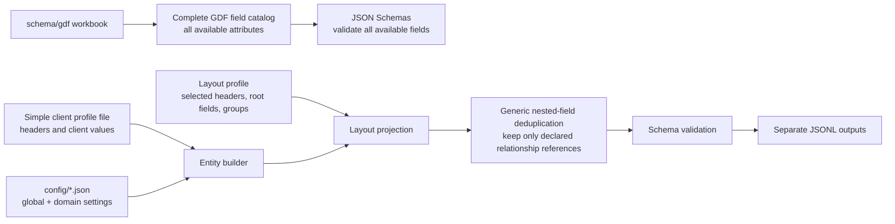

# Test Data Generator

Generate deterministic healthcare JSON Lines (JSONL) data for providers, members, professional claims (837P), institutional claims (837I), and their derived professional/institutional payment advice (835P/835I). The output uses the configured field names, JSON structure, and record relationships without copying real data.

The generator creates deterministic new records and can derive update fixtures from those records. Update operations are driven by the checked-in rule catalog, with optional field-level selection for targeted tests.

## What it writes

| Entity | Output file | Description |
| --- | --- | --- |
| Provider CDF | `provider_cdf.jsonl` | Provider identity, address, and network data. |
| Provider NPPES | `provider_nppes.jsonl` | Code-defined NPPES provider entities and nested provider data. |
| Member 834 | `members.jsonl` | Member, address, enrollment, and coordination-of-benefits data. |
| Member Roster | `member_roster.jsonl` | Source-derived Member data with `FILE_TYPE` set to `MR`. |
| Professional claim | `claims_professional.jsonl` | Professional claim headers, details, and embedded payment fields. |
| Professional claims history | `claims_history_professional.jsonl` | The corresponding professional claim history record. |
| Institutional claim | `claims_institutional.jsonl` | Institutional claim headers, details, and embedded payment fields. |
| Institutional claims history | `claims_history_institutional.jsonl` | The corresponding institutional claim history record. |
| Professional payment | `payments_professional.jsonl` | Standalone Payment P envelope linked to a professional claim. |
| Institutional payment | `payments_institutional.jsonl` | Standalone Payment I envelope linked to an institutional claim. |

Professional and institutional claims and payments are distinct streams and are always written to separate files. Existing claim output continues to contain its embedded payment fields; standalone Payment P/I output is additive.

## Design

The project separates the fields that *can* be generated from the fields that are *currently emitted*. This avoids losing GDF coverage while keeping output identical in shape to the selected source layouts.



### GDF fields and schemas

The Excel workbook in [`schema/gdf/`](schema/gdf/) is the complete field
catalog. Replace it with an updated workbook, or add a newer `.xlsx` file; the
next generation run automatically detects the newest workbook and refreshes
the JSON Schemas under [`schema/json/`](schema/json/). This keeps every
available provider, member, and claim field—even fields not emitted today.

From the repository root, refresh schema properties with:

```sh
uv run python schema/tools/extract-gdf-catalogs.py schema/gdf/GDF\ Request\ File\ Layouts\ Standard.xlsx
```

Or verify that no GDF field is missing without writing files:

```sh
uv run python schema/tools/extract-gdf-catalogs.py schema/gdf/GDF\ Request\ File\ Layouts\ Standard.xlsx --verify
```

The schemas are the extension point for future layouts. A field is not removed
merely because a current source sample does not use it.

### Layouts control output

The JSON files under [src/test_data_generator/layouts/](src/test_data_generator/layouts/) are the output contract. A layout explicitly declares:

- transport/header fields;
- root fields;
- nested groups and their child fields; and
- parent references that must stay in a nested group.

Only fields selected by a layout are emitted. This is why a complete GDF catalog does not cause extra attributes to appear in generated JSONL. For example, the member layout explicitly selects the `CM_MEMBER_COB` nested group.

Nested projection is generic. If a nested object repeats a value already held by its parent, it is removed unless that group declares the field as a required parent reference. The layout—not entity-specific code—decides which structural links such as member or provider identifiers remain duplicated.

### Sample patterns and client headers

[`src/test_data_generator/samples/sample_shapes.json`](src/test_data_generator/samples/sample_shapes.json)
contains type-only patterns extracted from the supplied provider, member,
professional/institutional claim, and professional/institutional payment
samples. It makes the origin of optional defaults explicit without copying any
source values. Entity builders provide the realistic test values; the
pattern file fills remaining sample fields with type-compatible blanks.

`client` selects an entry in
[`src/test_data_generator/configuration/client_profiles.json`](src/test_data_generator/configuration/client_profiles.json).
That single file owns client-specific headers and values (payer, platforms,
product, source-system values, and similar envelope metadata). Entity builders
do not contain client-specific header literals.

To support a new client, add a complete top-level client entry with `headers` and `values` for each supported entity, then select that key through `client`. No separate generator implementation is needed. Layouts declare the headers they recognize, so profile values are emitted only when the selected entity layout includes that header.

## Configuration

`runconfig.json` is the only run-level configuration. It owns execution
scope, client, output directories, the shared rule/invalid catalogs, and one
reference for each domain scenario file:

```text
runconfig.json                         # execution + global output settings
config/
├── provider.config.json               # Provider creation and test scenarios
├── member.config.json                 # 834/MR creation and test scenarios
├── claims.config.json                 # 837P/837I/CH creation and test scenarios
└── payments.config.json               # 835P/835I creation and test scenarios
```

Each entity file is the single place for its test scenarios. Put ordinary
updates, invalid/missing/empty plans, match-code operation counts, weighted
boundaries, elasticity cases, and deterministic multi-field cases beside the
entity count. The shared rule catalog still defines healthcare matching and
field semantics; `invalid-values.json` remains the shared source for invalid
test values.

For example, this entity applies a deterministic, multi-field update plan:

```json
{
  "count": 3,
  "matching_method": "professional_claim_primary",
  "expected_outcome": "NO_MATCH",
  "operations": [
    {"type": "UPDATE", "fields": ["CH_PATIENT_FIRST_NAME"]},
    {"type": "EMPTY", "fields": ["CH_PATIENT_STATE"]},
    {"type": "INVALID", "fields": ["CH_PATIENT_ZIP"]},
    {"type": "MISSING", "fields": ["CH_PATIENT_LAST_NAME"]}
  ]
}
```

`UPDATE` is the only valid-difference operation. There is no separate
operation for “different”.

`member.mr` is optional. When enabled, the generator creates each roster row
from the corresponding emitted 834 Member row instead of invoking a second
Member generator. By default, the records are identical except that
`members.jsonl` has `FILE_TYPE: "834"` and `member_roster.jsonl` has
`FILE_TYPE: "MR"`. The roster count may be smaller than the Member count, but
it cannot exceed the number of source Member rows.

MR-specific operations use the same shared update engine and Member rule
catalog. Put `operations` directly under `member.mr`; only explicitly selected
fields and their established dependent fields change. For example:

```json
{
  "client": "chc",
  "member": {
    "count": 2,
    "mr": {
      "count": 2,
      "matching_method": "member_id_dob_gender",
      "operations": [
        {"type": "UPDATE", "fields": ["CM_MEMBER_EMAIL"]}
      ]
    }
  }
}
```

Use `MISSING` to remove a selected MR field, `EMPTY` to retain the key with an
empty value, or `INVALID` to apply the configured invalid fixture value. If the
MR block has no explicit operation, no MR update file is produced, even when
updates are enabled for another entity; the creation roster remains an exact
834-derived copy.

`count` is exact: `{"member": {"count": 10}}` writes exactly ten member objects. Operation quantities and operation maps are not accepted. The only exception is a same-run `REPLACEMENT` Payment paired with one automatically generated Claim: the Claim stream emits the required original and replacement pair (two Claims). Claims may run alone: their linked member and provider IDs are generated deterministically. When member/provider streams are selected too, the claim IDs link to the corresponding generated records. A Payment stream requires either its corresponding enabled Claim stream or an explicit `source_claims` file only when it has a claim-backed scenario (`MATCHED`, `REVERSAL`, `REPLACEMENT`, or `STALE`); an `ORPHAN`-only stream is valid without Claims.

An entity with `count: 0` is treated as disabled. It is accepted by the
configuration schema, skipped by both creation and update generation, and its
stale known output files are removed after a successful run. This allows a
configuration to generate only the entities with positive counts.

`seed` is not a business date or source-layout version. Reusing the same
configuration and explicit seed produces the same test records; changing it
produces a different deterministic set. When omitted, the generator creates a
fresh per-run seed so independently generated datasets have varied names,
addresses, identifiers, and other Faker-backed values.

### Claim and payment relationships

Each enabled Claim type produces a paired current Claim and Claims History file.
They share one standardized overall JSON contract across Institutional and
Professional Claims. The paired rows are identical except for
`CH_CLIENT_CLAIM_UNIQUE_ID`, `CH_CLIENT_CLAIM_ID`, and
`CH_CLIENT_ORIGINAL_CLAIM_ID`: current Claim rows emit those required fields as
empty strings, while the corresponding Claims History row carries generated
values. Same-run Payments derive from the History rows so their claim matching
identifiers and both provider NPIs remain populated.

Payment P and Payment I are separate 835 streams projected from immutable 837
Claim rows. The relationship is not based on an invented payment identifier.
It follows the source survivorship document's
composite match fields: patient, service dates, billing-provider tax ID/NPI,
rendering-provider NPI, subscriber, claim frequency, claim/header amount and
patient control number, plus the Payment P place-of-service/diagnosis fields or
Payment I type-of-bill/revenue fields. Claim-line matching additionally uses
line dates, procedure/revenue identifiers, modifiers, and line charge amount.
The paid-date fields `CH_CLAIM_PAID_DATE` and `CD_LINE_PAID_DATE` are retained
for payment-date matching.

Payment generation also derives the institutional reconciliation fields from
the generated claim amounts: patient responsibility follows patient liability,
contract amount follows allowed amount, and disallowed/discount amounts are
the charge-minus-allowed difference. These values are generated only when the
selected Payment layout declares the field. Each Payment record validates its
file type, claim type, required envelope fields, and configured relationship
fields before it is written.

To derive Payments from an existing immutable Claim JSONL file, add
`source_claims` to the selected Payment stream. The path is resolved relative
to the configuration file (or may be absolute). `scenarios` is optional; when
omitted, every Payment is `MATCHED`. Scenario counts may be less than the
Payment `count`; the remaining records are automatically generated as
`MATCHED`. Scenario counts may not exceed the Payment `count`:

```json
{
  "client": "chc",
  "seed": 20260805,
  "output_directory": "./output",
  "claims": {"professional": {"count": 7}},
  "payments": {
    "professional": {
      "count": 7,
      "scenarios": {
        "MATCHED": 3,
        "REVERSAL": 1,
        "REPLACEMENT": 1,
        "STALE": 1,
        "ORPHAN": 1
      }
    }
  }
}
```

Claims select valid frequency values `1`, `7`, and `8` deterministically at
random from the run seed, so no frequency distribution is required in the
configuration. `1` creates an original/admit-through-discharge Claim; `7`
creates a replacement linked to an original Claim and sets the adjustment type
to `2`; `8` creates a void/cancel linked to an original Claim, sets adjustment
type `1`, and emits a zero-paid `VOID` Claim. The generator always creates the
needed original Claim lineage before a replacement or void. A `frequencies`
map remains available only for an intentionally targeted lifecycle fixture.

### Ingestion-date relationship scenarios

Without this setting, both creation and update rows use the date of the run.
To produce repeatable date fixtures, configure an explicit existing date and
the requested relationship for update rows. `NEWER` and `OLDER` are one
calendar day after or before the existing date; `SAME` reuses it.

```json
{
  "generation": {
    "ingestion_dates": {
      "update": "NEWER",
      "overrides": {
        "member": "SAME",
        "provider": "OLDER",
        "claims": {"existing": "<YYYYMMDD>", "update": "NEWER"},
        "claims_history": {"existing": "<YYYYMMDD>", "update": "SAME"},
        "payments": {"existing": "<YYYYMMDD>", "update": "OLDER"}
      }
    }
  }
}
```

The supported override groups are `member`, `provider`, `claims`,
`claims_history`, and `payments`. The original string form controls only the
incoming relationship. The object form independently overrides both the
creation date (`existing`) and incoming relationship (`update`), which is useful
when Claims, Claims History, and Payments need distinct dates. The shared engine
applies these values to normal updates, propagated Claims History updates, and
Claim-derived Payment updates.

For a targeted Claim lifecycle instead of seed-selected frequencies, set
`claim_frequency` on a Claim stream:

```json
{
  "claims": {
    "professional": {"count": 1, "claim_frequency": "7"}
  }
}
```

`claim_frequency` accepts `1`, `7`, or `8` and cannot be combined with the
existing `frequencies` distribution. Re-running the same seeded Claim from
frequency `1` to `7` retains its root identity while producing revised claim
and line charge amounts.

Supported Payment scenarios are `MATCHED`, `REVERSAL`, `REPLACEMENT`, `STALE`,
and `ORPHAN`. `REPLACEMENT` selects only source Claims whose
`CH_CLAIM_FREQUENCY_CODE` is `7`; `REVERSAL` sets `CLP02` to `22`; `STALE`
uses an older payment date; and `ORPHAN` changes Payment-side matching keys
only. The source Claim JSONL is never modified. Both Payment P and Payment I
use the same mechanism; their declared layouts and schemas determine which
fields are emitted.

When a Claim stream and its corresponding Payment stream are both enabled in
one invocation, the runtime automatically links the Payment stream to the
Claims History rows just generated in that run; no generated-file path is
required.
Claims are generated before Payments, so one `uv run generate-data` invocation
is sufficient. `source_claims` remains available only when deliberately
deriving Payments from an external, pre-existing Claim JSONL file.

Payment update files are deliberately event-driven. A global Claim update does
not create a Payment update file. To generate an updated 835 fixture, set an
explicit `updates.operation` under the corresponding `payments.professional`
or `payments.institutional` block; use that only for a payment/adjudication
event that needs a separate update fixture.

## Generate data

Install Python 3.12+ and [uv](https://docs.astral.sh/uv/), then install the project dependencies:

```sh
uv sync --extra dev
```

Generate with the checked-in configuration:

```sh
uv run generate-data
```

The default configuration generates both creation and update fixtures. New data
is written under `output/new-test-data/`; update data is written under
`output/update-test-data/`. Each update is derived
from the matching creation record using the same seed and row index.

Run only one side of the workflow when needed:

```sh
uv run python -m test_data_generator generate --config runconfig.json --mode creation
uv run python -m test_data_generator generate --config runconfig.json --mode updates
```

### Provider NPPES/CDF fixtures

Generate matched and unmatched provider fixtures from the supplied NPPES
sample with:

```sh
uv run python -m test_data_generator provider-cdf \
  --output output/provider-cdf \
  --count 10 \
  --unmatched-count 2
```

This writes `provider_nppes.jsonl` and `provider_cdf.jsonl`. The first `count`
CDF NPIs match the generated NPPES NPIs; additional CDF records use unique
NPIs absent from NPPES. The duplicate `provider_cdf_updated.jsonl` output is
not created: configured updates are written by the normal workflow to
`update-test-data/provider_cdf.update.jsonl`.

NPPES entity type `1` (`Individual`) and `2` (`Organization`) use separate
code-defined profiles (`provider-nppes-individual` and
`provider-nppes-organizational`). The corresponding CDF record maps them to
`CP_PROVIDER_RECORD_TYPE` values `1` and `2` (`1` is an individual provider and
`2` is a facility/organizational provider), and network indicators are only
`Y` or `N`. Their layouts and schemas are stored separately under
`src/test_data_generator/layouts/` and `schema/json/provider/`.

The normal configuration-driven generation supports the two provider streams
independently. `provider` writes `provider_cdf.jsonl`, while `provider_nppes`
writes `provider_nppes.jsonl`; either count can be `0` to skip that file. NPPES
fields and nested entities are generated by the provider NPPES entity module;
no sample file is required.

Updates use five generic operations instead of a separate operation per field or field
combination:

```json
{"operation": {"type": "UPDATE", "fields": ["CM_MEMBER_FIRST_NAME"]}}
{"operation": {"type": "MISSING", "fields": ["CM_MEMBER_SSN"]}}
{"operation": {"type": "EMPTY", "fields": ["CM_MEMBER_MIDDLE_NAME"]}}
{"operation": {"type": "INVALID", "fields": ["CM_MEMBER_GENDER"]}}
{"operation": {"type": "WEIGHT_CHANGE", "fields": ["FIELD_A", "FIELD_B"], "condition": "AT_LIMIT"}}
```

Fields may be omitted to select an eligible field deterministically from the
configured rule catalog. `MISSING` removes the attribute, while `EMPTY` keeps
the attribute and assigns its empty model value. `INVALID` reads values from
`src/test_data_generator/configuration/invalid-values.json`, keyed by the
actual field name when a domain-specific invalid form is needed. Every emitted
layout field supports explicit `UPDATE`, `MISSING`, and `INVALID`; fields not
listed in the invalid-value catalog use a deliberate generic invalid sentinel.
Weight conditions are `BELOW_LIMIT`, `AT_LIMIT`, and `ABOVE_LIMIT`. Matching
keys are excluded from weight changes.

```json
"provider": {
  "nppes": {
    "count": 10,
  },
  "cdf": {"additional_count": 5}
}
```

A per-entity `updates` block can specify
`fields`, `include`, `exclude`, `matching_method`, and `threshold`; explicit
fields take precedence over include/exclude selection.

Field lists may contain comma-separated values and surrounding whitespace. Names
are matched case-insensitively after normalization; punctuation such as the `+`
in `CP+Provider_npi` is normalized to `_`, and `Provider_npi` is an alias for
`CP_PROVIDER_NPI`. Matching keys may only be selected with `INVALID` or
`MISSING`, because changing them would prevent the update from matching the
existing entity. The structural discriminators `CH_CLAIM_TYPE`, `FILE_TYPE`,
and `cotiviti.source_format` likewise support `INVALID` and `MISSING` but not
normal `UPDATE`, because changing them would make the record belong to a
different stream. An `INVALID` fixture is intentionally allowed to violate the
JSON Schema; a field-specific catalog value is used when available and a
generic invalid sentinel is used otherwise.

The default catalog covers format and domain violations for member, provider,
claim, claim-detail, and payment fields (identifiers, demographic values,
dates, addresses, contact data, amounts, codes, and statuses). It is a test
fixture catalog: its values are deliberately malformed and are not used by
normal creation or valid-update generation.

Update selection is layout-aware. The survivorship catalog may describe fields
for multiple Payment or Claim profiles, but an update can only target a field
emitted by the selected layout. Automatic selection filters to emitted fields;
an explicit non-emitted field produces a direct configuration error instead of
a schema `oneOf` failure.

### Update field reference

The field names below are the currently supported runtime fields from the
normalized rule catalog. The domain manifest remains the source of truth:
[`update-rule-catalog.json`](src/test_data_generator/configuration/update-rule-catalog.json).

| Entity | Matching keys | Baseline required update fields | Baseline optional update fields |
| --- | --- | --- | --- |
| Member | `CM_MEMBER_CLIENT_ID` | `CM_PAYER_SHORT`, `CM_MEMBER_FIRST_NAME`, `CM_MEMBER_LAST_NAME`, `CM_MEMBER_BIRTH_DATE`, `CM_MEMBER_GENDER`, `CM_MEMBER_SSN` | `CM_MEMBER_MIDDLE_NAME`, `CM_MEMBER_STATE`, `CM_MEMBER_ZIP` |
| Provider | `CP_PROVIDER_NPI`, `CP_PROVIDER_FEDERAL_TAX_ID`, `CP_PROVIDER_CLIENT_ID` | `CP_PROVIDER_FIRST_NAME`, `CP_PROVIDER_LAST_NAME`, `CP_PROVIDER_TAXONOMY_CODE` | `CP_PROVIDER_MIDDLE_NAME`, `CP_PROVIDER_BILLING_GROUP_NAME`, `CP_PROVIDER_ZIP` |
| Professional Claim | `CH_CLIENT_CLAIM_ID`, `CH_PATIENT_CLIENT_ID`, `CH_BILLING_PROVIDER_NPI` | `CH_CLAIM_SERVICE_FROM_DATE`, `CH_CLAIM_SERVICE_TO_DATE`, `CH_CLAIM_FREQUENCY_CODE`, `CH_PATIENT_ACCOUNT_CONTROL_NUMBER` | `CH_PATIENT_FIRST_NAME`, `CH_PATIENT_MIDDLE_NAME`, `CH_PATIENT_LAST_NAME`, `CH_CHARGE_AMOUNT`, `CD_CHARGE_AMOUNT`, `CH_ALLOWED_AMOUNT`, `CD_ALLOWED_AMOUNT`, `CH_COINSURANCE_AMOUNT`, `CD_COINSURANCE_AMOUNT`, `CH_COPAY_AMOUNT`, `CD_COPAY_AMOUNT`, `CH_DEDUCTIBLE_AMOUNT`, `CD_DEDUCTIBLE_AMOUNT`, `CH_PATIENT_LIABILITY_AMOUNT`, `CD_PATIENT_LIABILITY_AMOUNT`, `CH_PAID_AMOUNT` |
| Institutional Claim | `CH_CLIENT_CLAIM_ID`, `CH_PATIENT_CLIENT_ID`, `CH_BILLING_PROVIDER_NPI` | `CH_TYPE_OF_BILL_CODE`, `CH_CLAIM_SERVICE_FROM_DATE`, `CH_CLAIM_SERVICE_TO_DATE`, `CH_PATIENT_ACCOUNT_CONTROL_NUMBER` | `CH_PATIENT_FIRST_NAME`, `CH_PATIENT_MIDDLE_NAME`, `CH_PATIENT_LAST_NAME`, `CH_CHARGE_AMOUNT`, `CD_CHARGE_AMOUNT`, `CH_ALLOWED_AMOUNT`, `CD_ALLOWED_AMOUNT`, `CH_COINSURANCE_AMOUNT`, `CD_COINSURANCE_AMOUNT`, `CH_COPAY_AMOUNT`, `CD_COPAY_AMOUNT`, `CH_DEDUCTIBLE_AMOUNT`, `CD_DEDUCTIBLE_AMOUNT`, `CH_PATIENT_LIABILITY_AMOUNT`, `CD_PATIENT_LIABILITY_AMOUNT`, `CH_PAID_AMOUNT` |

Scenario selection rules:

Required and optional classification is context-aware. A field can be
required for one matching method and optional for another;
the catalog uses `required_in` and `optional_in` for those overrides, while
the legacy `required` value remains the fallback. For example,
`CM_MEMBER_FIRST_NAME` eligibility is controlled by the rule catalog.

| Scenario | Supported fields |
| --- | --- |

Example for a targeted Member update:

```json
{
  "member": {
    "count": 1,
    "operations": [
      {"type": "UPDATE", "fields": ["CM_MEMBER_SSN"]}
    ]
  }
}
```

The normalized catalog manifest at
`src/test_data_generator/configuration/update-rule-catalog.json` composes
isolated Member, Provider, Claims, and Payments configurations under
`src/test_data_generator/configuration/rules/`. It records source document
revision `0.9`, entity keys, matching methods, field classification,
elasticity, weights, and survivorship behavior. Claims History aliases are
defined directly by the Claims domain because CH is a paired Claim
representation, not an independent matching model. The legacy combined
catalog remains supported for existing run configurations. The DOCX is the
business source; the JSON catalog is the runtime contract and must be
regenerated/reviewed when the source document changes.

- [`rules/member.json`](src/test_data_generator/configuration/rules/member.json)
  owns Member rules.
- [`rules/provider.json`](src/test_data_generator/configuration/rules/provider.json)
  owns Provider rules.
- [`rules/claims.json`](src/test_data_generator/configuration/rules/claims.json)
  owns Professional and Institutional Claim rules and Claims History aliases.
- [`rules/payments.json`](src/test_data_generator/configuration/rules/payments.json)
  owns Professional and Institutional Payment rules.

### Relationship-aware updates

Updates are applied through the shared synchronizer in
`src/test_data_generator/update/synchronization.py`. It recalculates an
existing `*_FULL_NAME` from its available first, middle, and last name parts;
it also synchronizes matching `CH_`/`CD_` representations of the same value
(including claim amounts) and the provider NPI pair when both original values
were populated and equal. These rules are structural and apply to every
matching occurrence in nested claim details, rather than being tied to one
operation or entity generator.

The original record is used as the applicability check. A related field is
updated only when it was present and populated originally. Empty strings,
`null` values, and missing fields remain unchanged; unrelated fields and
independent fields whose original values differ are not synchronized.

### Verified match fixtures

An update request can opt into a paired matching fixture. The normal creation
JSONL is the existing record set and the normal update JSONL is the incoming
record set; no auxiliary metadata file is written. The generator verifies the
requested outcome and cross-method collisions before it publishes the update.

```json
{
  "claims": {
    "professional": {
      "count": 1,
      "matching_method": "professional_claim_fallback",
      "expected_outcome": "MATCH",
      "operations": [
        {"type": "UPDATE", "fields": ["CH_PAYER_ORGANIZATION_NAME"]},
        {"type": "DUPLICATE"}
      ]
    }
  }
}
```

`expected_outcome` is either `MATCH` or `NO_MATCH`. A `NO_MATCH` fixture must
declare `failure_mode`: `MANDATORY_BREAK_EXACT`,
`MANDATORY_BREAK_BOUNDARY`, `INVALID_VALUE`, `MISSING_VALUE`, `WEIGHT_MISS`,
or `CROSS_METHOD_COLLISION`. Use `failure_field` for the target mandatory
anchor, `collision_method` for an intended cross-method collision, and
`elasticity_boundary` (`INSIDE`, `AT`, or `OUTSIDE`) for date-tolerance tests.
`INVALID`, `MISSING`, and `EMPTY` cannot modify a mandatory target anchor in a
positive fixture. Independent non-anchor operations are declared through
`operations`; each entry has a `type` and optional `fields` list. `UPDATE`
always supplies a valid value different from the existing record.
`INVALID` values are always read from the shared
[`invalid-values.json`](src/test_data_generator/configuration/invalid-values.json)
catalog, first by exact field and then by configured field type; no invalid
value is fabricated by the generator.
For a weighted method, `include` keeps only the selected optional anchors
matched and deliberately varies the remaining optional anchors; `exclude`
forces the named optional anchors to differ. The evaluator then verifies that
the configured needed weight is still reached.

The domain rule files explicitly describe method anchors, mandatory/optional
classification, needed weight, field-level elasticity, and
`higher_priority_methods`. Current strict relationships are:

- Professional Claims: `professional_claim_primary` strictly contains
  `professional_claim_fallback`.
- Institutional Claims: `institutional_claim_primary` strictly contains
  `institutional_claim_fallback`.
- Payments: each `claim_method_1` strictly contains `claim_method_2`, and
  each `payment_835_method_1` strictly contains `payment_835_method_2`.
- Members: `member_id_dob_gender` is more specific than `member_id`; the
  name-based method is independent of Member ID and diverges the ID when it
  must avoid the Member-ID method. Weighted Member methods are separate
  configurable contracts.
- Providers: deterministic identifier and individual/organizational composite
  methods are independent alternatives, so no unsupported subset relationship
  is inferred.

### Header ordering

JSON object order does not affect parsing, but the output order can be
configured for readability or systems that compare serialized fixtures. Set
the global order in `generation.output_order.headers`:

```json
{
  "generation": {
    "output_order": {"headers": "last"}
  }
}
```

Supported values are `source`, `first`, and `last`. An entity can override the
global value with `output_order.headers` inside its `member`, `provider`, or
`claims` configuration block. Ordering is applied after layout projection for
both creation and update JSONL files. The layout header set includes fields
such as `INGESTION_DATE`, `INGESTION_EPOCH`, `ROWID`, `cotiviti.message_id`,
`cotiviti.produced_at`, `cotiviti.batch_id`, `cotiviti.message_seq`,
`cotiviti.correlation_id`, `cotiviti.source.raw_file_ref`, and `FILE_TYPE`.

To audit the DOCX revision and preserve its tables as source evidence:

```sh
make extract-source
```

`generate-data` automatically refreshes schemas from `schema/gdf/` first. To
use another configuration file:

```sh
uv run python -m test_data_generator generate --config path/to/config.json
```

For the checked-in configuration, generated files appear in `./output`:

```text
output/
├── new-test-data/
│   ├── provider_cdf.jsonl
│   ├── provider_nppes.jsonl
│   ├── members.jsonl
│   ├── member_roster.jsonl
│   ├── claims_professional.jsonl
│   ├── claims_history_professional.jsonl
│   ├── claims_institutional.jsonl
│   ├── claims_history_institutional.jsonl
│   ├── payments_professional.jsonl
│   └── payments_institutional.jsonl
└── update-test-data/
    ├── provider_cdf.update.jsonl
    └── ...
```

Each line is a complete JSON object. Records are validated against their JSON Schema before publication. Files are written atomically, so a failed entity run does not replace that entity's prior output. If an entity is omitted from a later successful run, only its known generated output is removed; unrelated output-directory files are not touched.

## Verify the generator

Run the source lint, format, and type checks:

```sh
make verify
```

## Project layout

```text
runconfig.json                                 # Execution scope and selected phases
config/                                        # Modular global, domain, and common settings
schema/
├── gdf/                                      # Replaceable GDF Excel source
├── json/                                     # Complete GDF-aware JSON Schemas
└── tools/                                    # GDF schema refresh utility
src/test_data_generator/
├── configuration/                            # Client profiles and config loading
├── core/                                     # Generation, validation, identifiers
├── entities/                                 # Provider, member, claim, and payment builders
├── layouts/                                  # Current JSON output-selection contracts
├── samples/                                  # Sample type patterns and source references
└── cli.py                                    # Command-line entry point
```

## Current scope

- JSONL is the only output format.
- Data is test and intended for development, integration, and processing exercises; the generator produces matching/survivorship fixtures but is not a production matching or adjudication engine.
- Provider, member, professional claim, and institutional claim are the currently supported entity streams.
- Update generation is layered after creation generation; operation rules are reusable across supported entity streams.
