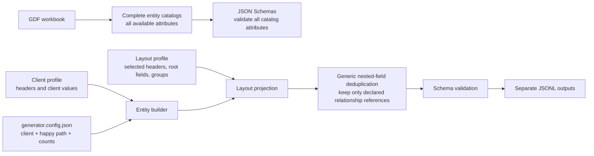

# Test Data Generator

Generate deterministic, synthetic healthcare JSON Lines (JSONL) data for providers, members, professional claims, and institutional claims. The output uses the field names, JSON structure, and record relationships represented by the supplied source samples, without copying real data.

The generator has one deliberately simple purpose today: create **happy-path** records. It does not generate duplicate, stale, incomplete, replacement, void, or matching/survivorship scenarios. The internal boundaries leave room to add those later without changing the catalog, layout, client-profile, or publishing layers.

## What it writes

| Entity | Output file | Description |
| --- | --- | --- |
| Provider | `providers.jsonl` | Provider identity, address, and network data. |
| Member | `members.jsonl` | Member, address, enrollment, and coordination-of-benefits data. |
| Professional claim | `professional-claims.jsonl` | Professional claim headers, details, and embedded payment fields. |
| Institutional claim | `institutional-claims.jsonl` | Institutional claim headers, details, and embedded payment fields. |

Professional and institutional claims are distinct streams and are always written to separate files. Payment data remains part of each claim object; the generator does not create a separate payment file.

## Design

The project separates the fields that *can* be generated from the fields that are *currently emitted*. This avoids losing GDF coverage while keeping output identical in shape to the selected source layouts.



### Complete catalogs and schemas

The checked-in catalogs under [src/healthcare_test_data/entities/catalogs/](src/healthcare_test_data/entities/catalogs/) contain every field extracted from the GDF reference for provider, member, and claim data. The JSON Schemas under [schemas/](schemas/) acknowledge those complete catalogs, including fields that are not presently written.

Those full catalogs are the extension point for future layouts. A field is not removed merely because a current source sample does not use it.

### Layouts control output

The JSON files under [src/healthcare_test_data/layouts/](src/healthcare_test_data/layouts/) are the output contract. A layout explicitly declares:

- transport/header fields;
- root fields;
- nested groups and their child fields; and
- parent references that must stay in a nested group.

Only fields selected by a layout are emitted. This is why a complete GDF catalog does not cause extra attributes to appear in generated JSONL. For example, the member layout explicitly selects the `CM_MEMBER_COB` nested group.

Nested projection is generic. If a nested object repeats a value already held by its parent, it is removed unless that group declares the field as a required parent reference. The layout—not entity-specific code—decides which structural links such as member or provider identifiers remain duplicated.

### Client profiles and headers

`client` selects a checked-in profile in [src/healthcare_test_data/clients/](src/healthcare_test_data/clients/). Profiles own client-specific headers and values (payer, platforms, product, source-system values, and similar envelope metadata). Entity builders do not contain client-specific header literals.

To support a new client, add a complete profile JSON file with `headers` and `values` for each supported entity, then select its filename (without `.json`) through `client`. No separate generator implementation is needed. Layouts declare the headers they recognize, so profile values are emitted only when the selected entity layout includes that header.

## Configuration

[generator.config.json](generator.config.json) is the only run-time file you normally edit. It has four concepts:

- `client` — the checked-in client profile to use;
- `scenario` — currently required and always `"happy-path"`;
- `seed` — integer used to reproduce a deterministic run; and
- entity `count` values — the exact number of objects to write.

`schema`, `module`, output filenames, and layout names are internal defaults. They are intentionally not configurable. Omit an entity to skip its output.

```json
{
  "client": "chc",
  "scenario": "happy-path",
  "seed": 20260805,
  "output_directory": "./output",
  "provider": {"count": 10},
  "member": {"count": 10},
  "claims": {
    "professional": {"count": 10},
    "institutional": {"count": 10}
  }
}
```

`count` is exact: `{"member": {"count": 10}}` writes exactly ten member objects. Scenario quantities and scenario maps are not accepted. Claims require both member and provider generation because generated claims link to those records.

`seed` is not a business date or source-layout version. Reusing the same configuration and seed produces the same synthetic records; changing the seed produces a different deterministic set.

## Generate data

Install Python 3.12+ and [uv](https://docs.astral.sh/uv/), then install the project dependencies:

```sh
uv sync --extra dev
```

Generate with the checked-in configuration:

```sh
make generate
```

Or provide another configuration file:

```sh
uv run python -m healthcare_test_data generate --config path/to/config.json
```

For the checked-in configuration, generated files appear in `./output`:

```text
output/
├── providers.jsonl
├── members.jsonl
├── professional-claims.jsonl
└── institutional-claims.jsonl
```

Each line is a complete JSON object. Records are validated against their JSON Schema before publication. Files are written atomically, so a failed entity run does not replace that entity's prior output. If an entity is omitted from a later successful run, only its known generated output is removed; unrelated output-directory files are not touched.

## Verify the generator

Run the source lint, format, and type checks:

```sh
make verify
```

Run the test suite:

```sh
uv run pytest
```

The tests verify the key contracts:

- complete checked-in GDF catalog coverage in schemas and entity catalogs;
- optional comparison of those catalogs with the supplied GDF workbook when it is available locally;
- simple happy-path config validation and rejection of legacy scenario maps;
- client-profile header selection, including an alternate profile;
- separate professional and institutional claim generation;
- `CM_MEMBER_COB` layout selection; and
- layout projection plus generic, declarative nested-field deduplication.

## Project layout

```text
generator.config.json                         # One simple generation request
schemas/                                      # Complete GDF-aware JSON Schemas
src/healthcare_test_data/
├── clients/                                  # Client headers and generation values
├── entities/
│   ├── catalogs/                              # Complete GDF field catalogs
│   └── provider.py, member.py, claim.py       # Source-shaped record builders
├── layouts/                                  # Current JSON output-selection contracts
├── config.py                                 # Public config normalization/validation
├── engine.py                                 # Generate, project, validate, publish
└── cli.py                                    # Command-line entry point
tests/                                        # Catalog, config, header, and layout checks
```

## Current scope

- JSONL is the only output format.
- Data is synthetic and intended for development, integration, and processing exercises; it is not a full matching, survivorship, or adjudication engine.
- Provider, member, professional claim, and institutional claim are the currently supported entity streams.
- Future scenario generation can be layered in after happy-path generation without changing the public catalog/layout/client-profile separation.
