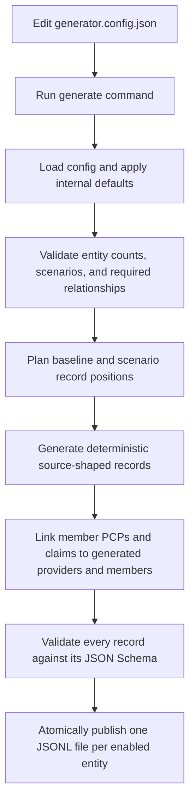

# Test Data Generator

Generate deterministic, synthetic healthcare source data as JSON Lines (JSONL).
The generator creates provider, member, professional-claim, and
institutional-claim records whose fields
follow the checked-in GDF-derived layouts. It is intended for development,
integration, and data-processing exercises where realistic field shapes,
relationships, and non-happy-path variations are useful, without using real
member or provider data.

The project is deliberately small and configuration driven: choose the entity,
the number of records, and the variations to include. The generator writes only
the requested entity data files.

## What it generates

| Entity | Output file by default | Contents |
| --- | --- | --- |
| Provider | `providers.jsonl` | Provider identity, NPI/TIN, address, and network groups. |
| Member | `members.jsonl` | Member/subscriber identity, address, enrollment, and PCP provider link. |
| Professional claim | `professional-claims.jsonl` | Professional medical-claim header and detail records, with payment amounts embedded in each claim. |
| Institutional claim | `institutional-claims.jsonl` | Institutional medical-claim header and detail records, with payment amounts embedded in each claim. |

All output is synthetic. No real source record is copied into generated files.

## How generation works



Each JSONL line is a complete JSON object. A claim's payment fields and claim
detail rows are part of the same claim object; no separate payment file is
created.

## Prerequisites and installation

Install Python 3.12 or newer and [uv](https://docs.astral.sh/uv/). From the
repository root, install the project and development tools:

```sh
uv sync --extra dev
```

## Quick start

The checked-in [generator.config.json](generator.config.json) generates all
four entity streams. Run:

```sh
uv run python -m healthcare_test_data generate --config generator.config.json
```

Or use the shortcut:

```sh
make generate
```

The default output directory is `./output`. With the checked-in configuration,
the run creates:

```text
output/
├── providers.jsonl
├── members.jsonl
├── professional-claims.jsonl
└── institutional-claims.jsonl
```

The command prints the record count and final path for every enabled entity.

## Configuration

`generator.config.json` is the only file you normally edit. Add the entity or
claim stream you want to generate, then set its exact `count` and optional
scenario quantities. Omit it to skip it.

`schema` and `module` are intentionally not configuration options. The
generator selects the appropriate checked-in schema, entity implementation,
layout, and output filename internally. Claims stay in one `claims` object,
but professional and institutional rows are still written to separate files.

### Minimal configuration

This creates exactly 10 members. Five rows are the configured variations and
the other five are ordinary baseline records.

```json
{
  "member": {
    "count": 10,
    "scenarios": {
      "new": 1,
      "changed": 1,
      "duplicate": 1,
      "stale": 1,
      "incomplete": 1
    }
  }
}
```

In short form, omit an entity to skip it. `seed` defaults to `20260805`,
`output_directory` defaults to `./output`, and default filenames are used.

### Counts and scenario quantities

`count` is always the exact number of JSON objects written for that entity.
Scenario quantities do not add extra rows; they take the place of ordinary
baseline rows.

For example, this configuration writes exactly 10 member objects:

```json
{
  "member": {
    "count": 10,
    "scenarios": {
      "new": 1,
      "changed": 1,
      "duplicate": 1,
      "stale": 1,
      "incomplete": 1
    }
  }
}
```

It produces five baseline rows and one row for each named scenario. Scenario
quantities may be zero. Their total cannot exceed `count`. Any non-`new`
scenario requires at least one baseline row because it is derived from an
existing generated record.

### Seed

`seed` is an integer that makes generation repeatable. It is not a business
date and does not select a source-data version.

```json
{
  "seed": 20260805,
  "provider": {"count": 10}
}
```

Use the same configuration and seed to reproduce the same records. Change the
seed to generate a different, still deterministic, set of synthetic values.
`20260805` is simply the repository's default seed value.

### Claim entity selection

Claims use one simple top-level object. Add `professional`, `institutional`,
or both beneath `claims`; each contains only `count` and optional `scenarios`.
They are generated separately into their fixed source-shaped JSONL files.

```json
{
  "provider": {"count": 10},
  "member": {"count": 10},
  "claims": {
    "professional": {"count": 10, "scenarios": {"replacement": 1}},
    "institutional": {"count": 10, "scenarios": {"void": 1}}
  }
}
```

The old `claim`, `claim_professional`, `claim_institutional`, and `entities`
keys are rejected. Use `claims.professional` and/or `claims.institutional`
instead.

## Scenario variations

Variations are represented through ordinary source fields in the entity JSONL
objects. The output does not add a synthetic scenario label.

| Scenario | Supported by | Generated behavior |
| --- | --- | --- |
| `new` | Provider, member, both claim entities | An independently generated source record. |
| `changed` | Provider, member, both claim entities | A baseline record with a newer source update timestamp and changed source fields. |
| `duplicate` | Provider, member, both claim entities | A second copy of a baseline record. |
| `stale` | Provider, member, both claim entities | A baseline record with older source/update dates. |
| `incomplete` | Provider, member, both claim entities | A source-valid record with selected optional identity or contact fields absent. |
| `replacement` | Both claim entities | A later claim version with original/root claim lineage, adjustment information, and frequency code `7`. |
| `void` | Both claim entities | A claim variation marked with frequency code `8` and void status. |
| `orphan_payment` | Both claim entities | A payment-shaped variation whose identifying composite is deliberately changed so it does not match its claim. |

Provider and member accept the first five scenarios. Both claim entities accept all eight.
Unknown scenario names, negative quantities, and totals greater than `count`
are rejected before output is created.

## Relationships in generated data

When provider, member, and either claim output are enabled together, relationships
use identifiers from the generated records:

- Each member enrollment's PCP provider ID cycles through the generated
  provider records.
- Each claim's patient and subscriber identifiers come from a generated member.
- Each claim's billing, rendering, referring, facility, attending, and
  operating provider identifiers come from a generated provider.
- Claim line rendering-provider identifiers use the same generated provider.
- Claim header and line payment amounts reconcile as `allowed = member
  liability + paid`.

The relationship selection accounts for configured scenario positions, so a
linked ID refers to the record shape emitted for that position.

## Output behavior and safety

Generation validates every object against its entity JSON Schema before it is
written. Each entity file is first written to a temporary file beside its
destination, then published only after the whole entity run succeeds. A failed
entity generation does not replace that entity's previous output file.

If a later detailed-form run disables a known entity, its fixed prior JSONL
file is removed after all enabled entities complete successfully. Unrelated
files in the output directory are left unchanged.

Current scope and limitations:

- JSONL is the only supported output format.
- Generated data is source-shaped synthetic data, not a full simulation of a
  downstream matching or adjudication system.
- Payment data is embedded in claim objects; there is no separate payment
  output.
- The generator currently supports provider, member, professional claim, and
  institutional claim entities only.

## Common commands

Generate from the checked-in configuration:

```sh
make generate
```

Generate from another configuration file:

```sh
uv run python -m healthcare_test_data generate --config path/to/config.json
```

Check formatting, linting, and type annotations:

```sh
make verify
```

## Project layout

```text
.
├── generator.config.json              # Editable generation request
├── schemas/                           # Checked-in JSON Schemas for each entity
├── src/healthcare_test_data/
│   ├── cli.py                         # Command-line entry point
│   ├── config.py                      # Config parsing and validation
│   ├── engine.py                      # Generation, validation, and JSONL publishing
│   ├── scenarios.py                   # Deterministic scenario-position planning
│   ├── entities/                      # Provider, member, and claim record builders
│   └── layouts/                       # Checked-in GDF-derived profile metadata
└── output/                            # Generated JSONL files (created at runtime)
```

To add a future entity, add its source-shaped schema, entity record builder,
layout profile if needed, and internal default mapping. The generic engine can
then validate and publish its JSONL output using the same configuration flow.
