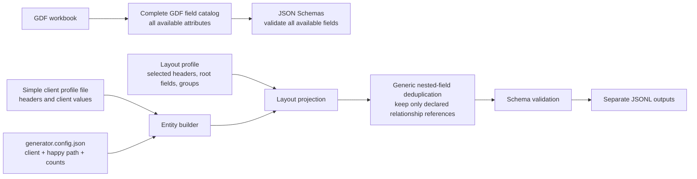

# Test Data Generator

Generate deterministic, synthetic healthcare JSON Lines (JSONL) data for providers, members, professional claims, and institutional claims. The output uses the field names, JSON structure, and record relationships represented by the supplied source samples, without copying real data.

The generator has one deliberately simple purpose today: create **happy-path** records. It does not generate duplicate, stale, incomplete, replacement, void, or matching/survivorship scenarios. The small generator/layout boundary leaves room to add those later without rebuilding the current workflow.

## What it writes

| Entity | Output file | Description |
| --- | --- | --- |
| Provider | `providers.jsonl` | Provider identity, address, and network data. |
| Member | `members.jsonl` | Member, address, enrollment, and coordination-of-benefits data. |
| Professional claim | `professional-claims.jsonl` | Professional claim headers, details, and embedded payment fields. |
| Institutional claim | `institutional-claims.jsonl` | Institutional claim headers, details, and embedded payment fields. |

Professional and institutional claims are distinct streams and are always written to separate files. Payment data remains part of each claim object; the generator does not create a separate payment file.

## Design

The project separates the fields that *can* be generated from the fields that are *currently emitted*. This avoids losing GDF coverage while keeping output identical in shape to the selected source layouts.



### GDF fields and schemas

The GDF workbook is the complete field catalog. Keep
[`scripts/extract_gdf_catalogs.py`](scripts/extract_gdf_catalogs.py) when the
workbook changes; it updates the JSON Schemas under [schemas/](schemas/) so
they continue to acknowledge every available provider, member, and claim
field, including fields that are not presently written.

From the repository root, refresh schema properties with:

```sh
uv run python scripts/extract_gdf_catalogs.py /path/to/GDF-layout.xlsx
```

Or verify that no GDF field is missing without writing files:

```sh
uv run python scripts/extract_gdf_catalogs.py /path/to/GDF-layout.xlsx --verify
```

The schemas are the extension point for future layouts. A field is not removed
merely because a current source sample does not use it.

### Layouts control output

The JSON files under [src/healthcare_test_data/layouts/](src/healthcare_test_data/layouts/) are the output contract. A layout explicitly declares:

- transport/header fields;
- root fields;
- nested groups and their child fields; and
- parent references that must stay in a nested group.

Only fields selected by a layout are emitted. This is why a complete GDF catalog does not cause extra attributes to appear in generated JSONL. For example, the member layout explicitly selects the `CM_MEMBER_COB` nested group.

Nested projection is generic. If a nested object repeats a value already held by its parent, it is removed unless that group declares the field as a required parent reference. The layout—not entity-specific code—decides which structural links such as member or provider identifiers remain duplicated.

### Sample patterns and client headers

[`src/healthcare_test_data/sample_shapes.json`](src/healthcare_test_data/sample_shapes.json)
contains type-only patterns extracted from the supplied provider, member,
professional/institutional claim, and professional/institutional payment
samples. It makes the origin of optional defaults explicit without copying any
source values. Entity builders provide the realistic synthetic values; the
pattern file fills remaining sample fields with type-compatible blanks.

`client` selects an entry in
[`src/healthcare_test_data/client_profiles.json`](src/healthcare_test_data/client_profiles.json).
That single file owns client-specific headers and values (payer, platforms,
product, source-system values, and similar envelope metadata). Entity builders
do not contain client-specific header literals.

To support a new client, add a complete top-level client entry with `headers` and `values` for each supported entity, then select that key through `client`. No separate generator implementation is needed. Layouts declare the headers they recognize, so profile values are emitted only when the selected entity layout includes that header.

## Configuration

[generator.config.json](generator.config.json) is the only run-time file you normally edit. It has four concepts:

- `client` — the checked-in client profile to use;
- `seed` — integer used to reproduce a deterministic run; and
- entity `count` values — the exact number of objects to write; and
- optional entity `layout` — a compatible checked-in output layout (the current
  layout is used when omitted).

`schema`, `module`, and output filenames are internal defaults. Omit an entity
to skip its output. A supplied layout must be valid for the selected data type:
for example, `provider` can use only `"provider"`, while professional claims
can use only `"claim-professional"` today.

```json
{
  "client": "chc",
  "seed": 20260805,
  "output_directory": "./output",
  "provider": {"count": 10},
  "member": {"count": 10},
  "claims": {
    "professional": {"count": 10},
    "institutional": {"count": 10}
  }
}
```

`count` is exact: `{"member": {"count": 10}}` writes exactly ten member objects. Scenario quantities and scenario maps are not accepted. Claims may run alone: their linked member and provider IDs are generated deterministically. When member/provider streams are selected too, the claim IDs link to the corresponding generated records.

`seed` is not a business date or source-layout version. Reusing the same configuration and seed produces the same synthetic records; changing the seed produces a different deterministic set.

## Generate data

Install Python 3.12+ and [uv](https://docs.astral.sh/uv/), then install the project dependencies:

```sh
uv sync --extra dev
```

Generate with the checked-in configuration:

```sh
make generate
```

Or provide another configuration file:

```sh
uv run python -m healthcare_test_data generate --config path/to/config.json
```

For the checked-in configuration, generated files appear in `./output`:

```text
output/
├── providers.jsonl
├── members.jsonl
├── professional-claims.jsonl
└── institutional-claims.jsonl
```

Each line is a complete JSON object. Records are validated against their JSON Schema before publication. Files are written atomically, so a failed entity run does not replace that entity's prior output. If an entity is omitted from a later successful run, only its known generated output is removed; unrelated output-directory files are not touched.

## Verify the generator

Run the source lint, format, and type checks:

```sh
make verify
```

Run the test suite:

```sh
uv run pytest
```

The tests verify the key contracts:

- complete GDF field availability in schemas;
- optional comparison of schemas with the supplied GDF workbook when it is available locally;
- simple config and count validation;
- client-profile header selection;
- separate professional and institutional claim generation;
- `CM_MEMBER_COB` layout selection; and
- layout projection plus generic, declarative nested-field deduplication.

## Project layout

```text
generator.config.json                         # One simple generation request
schemas/                                      # Complete GDF-aware JSON Schemas
src/healthcare_test_data/
├── entities/
│   └── provider.py, member.py, claim.py       # Source-shaped record builders
├── layouts/                                  # Current JSON output-selection contracts
├── client_profiles.json                       # Client header/value differences
├── sample_shapes.json                         # Type patterns from all supplied samples
├── config.py                                 # Public config normalization/validation
├── engine.py                                 # Generate, project, validate, publish
└── cli.py                                    # Command-line entry point
tests/                                        # Small extractor, config, and output-contract checks
```

## Current scope

- JSONL is the only output format.
- Data is synthetic and intended for development, integration, and processing exercises; it is not a full matching, survivorship, or adjudication engine.
- Provider, member, professional claim, and institutional claim are the currently supported entity streams.
- Future scenario generation can be layered in after happy-path generation without changing the simple config, layout, and entity builders.
